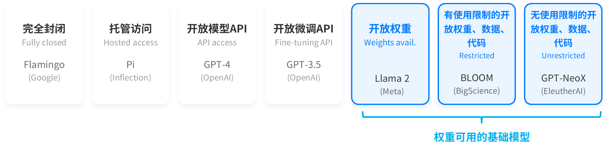
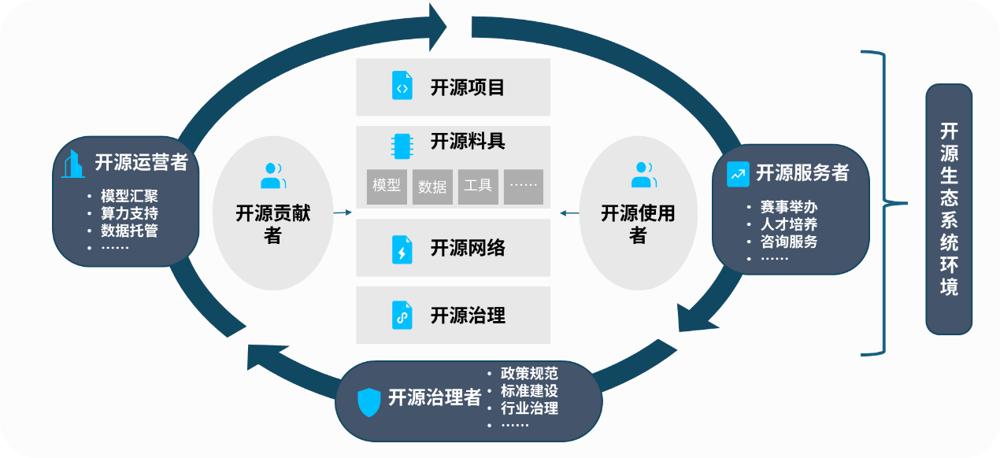
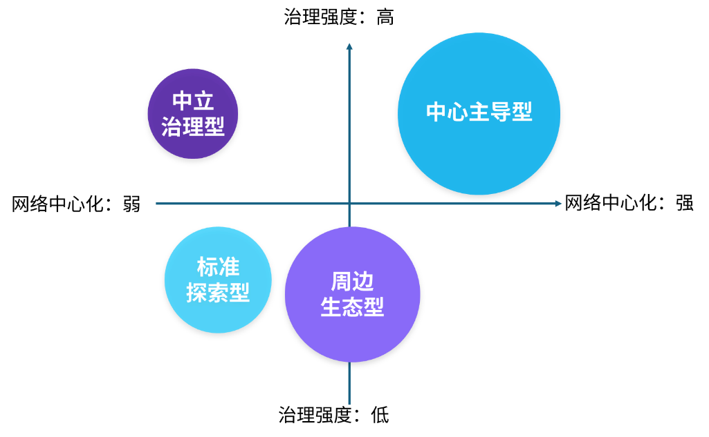
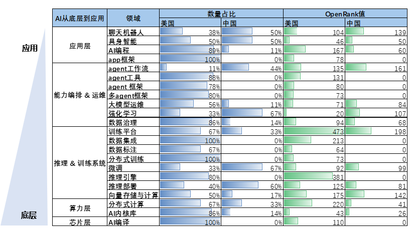

**中国人工智能开源生态蓝皮书**

**Datawhale人工智能产业研究院**

**2026年3月**

**发布单位：**Datawhale

**联合发布单位：**

魔搭社区

上海交通大学人工智能研究院

浙江大学人工智能教育教学研究中心

传播大脑

潮新闻

**二O二六年三月**

**编委会：**徐旭初 范晶晶 司玉鑫

**项目组：**徐旭初 范晶晶 司玉鑫 江婧 甘元琦 马晶敏 曹宇

**编写组：**徐旭初 江婧 司玉鑫 陈立萌

**专家支持：**吴飞 金耀辉 王伟 姜开达 石洪竺 张健 林旅强 武卓 滕爱龄**\
前言**

在以大模型与智能体为代表的新一轮人工智能浪潮中，技术正以前所未有的速度重塑生产方式与社会结构。开源，作为数智时代最具生命力的协作创新机制，正在从软件领域的开发范式，跃迁为AI浪潮的基础设施与创新网络，成为降低技术门槛、加速创新扩散、重塑产业格局、助推创新就业的关键力量。我国高度重视AI开源生态建设，今年政府工作报告强调"打造智能经济新形态"，并明确提出要"支持人工智能开源社区建设，促进开源生态繁荣。"本蓝皮书立足这一时代背景，系统阐释AI开源生态的内涵与结构，指出AI开源生态不仅是技术性问题，更是关系国家竞争力、产业升级路径与人才培养体系的综合性命题。

与美欧以市场驱动为主的开源生态不同，中国AI开源生态发展呈现出鲜明的"应用牵引+多元协同"特征：既有头部企业通过开源项目及相关活动构建生态入口，也有地方政府通过制度供给与资源整合推动生态培育，高校与社区则在人才供给与能力沉淀中发挥重要作用。这种多主体协同发展的独特路径，使中国具备在较短时间内实现"从应用繁荣走向生态构建"的潜力，但同时也带来认知与机制上的挑战。

当前，中国AI开源生态仍面临若干关键瓶颈：一是对"开源生态"的理解仍停留在"项目集合"，缺乏系统性协同思维；二是技术、产业与人才之间衔接不畅，难以形成可持续的能力沉淀；三是创新转化不足，就业带动不足；四是中立治理与公共基础设施相对薄弱，生态韧性有待提升；五是在全球技术体系中，自主可控能力仍需加强。这些问题的本质，在于尚未实现从"项目思维"向"生态思维"的认知跃迁。

基于此，本蓝皮书围绕"是什么、为什么、现状如何、问题何在、如何推进"五个核心问题展开：首先界定AI开源生态的关键要素与运行机制；其次从国家、地方、市场与人才多维度论证其战略意义；进而梳理中国AI开源生态的发展现状与典型模式，并通过中美对比揭示结构性差异；在此基础上，系统分析当前面临的核心问题；最终提出面向政府、企业、高校与社会组织的协同发展路径与策略建议。

我们希望，本蓝皮书不仅提供一份关于中国AI开源生态的全景式观察，更重要的是，为相关决策者与实践者提供一套从"点状突破"走向"系统构建"的方法参考，推动中国在全球AI竞争格局中，从参与者尽快迈向生态构建者与规则共建者。

**\**

# 目录

第一章 何为AI开源生态 ... 1

1.1 开源与开源生态 ... 1

1.2 AI开源与AI开源生态 ... 1

第二章 中国为何必须加快发展AI开源生态 ... 3

2.1 国家战略意义：占据时代潮头，提升国家竞争力 ... 3

2.2 地方发展意义：赋能产业升级，促进地方发展 ... 4

2.3 市场发展意义：催生商业模式，助推创新就业 ... 5

2.4 人才发展意义：推动产学衔接，加速人才成长 ... 6

第三章 中国AI开源生态的发展情况 ... 9

3.1 AI开源生态的核心要素 ... 9

3.2 AI开源项目的生态模式 ... 11

3.3 AI开源生态的中国现状 ... 14

3.3.1 中国AI开源项目图谱 ... 14

3.3.2 中国AI开源生态发展的典型城市 ... 15

3.4 AI开源生态的中美比较 ... 21

3.4.1 发展目标差异：中国应用牵引，美国市场驱动 ... 21

3.4.2 发展路径差异：中国应用繁荣，美国全链控制 ... 21

3.4.3 生态模式差异：中国中心与场景双驱，美国多元均衡 ... 22

3.4.4 人才情势差异：中国规模追赶，美国体系成熟 ... 23

3.4.5 治理格局差异：中国成长培育，美国制度完备 ... 24

第四章 中国AI开源生态发展的现实问题 ... 25

4.1 生态属性认知不足，产业思维相对浓重 ... 25

4.1.1 政府层面：生态属性把握不足，角色边界意识薄弱 ... 25

4.1.2 企业层面：战略定位比较短视，生态意识相对薄弱 ... 25

4.1.3 高校层面：评价导向比较单一，能力培养严重滞后 ... 26

4.2 产业衔接不畅，技术落地受阻 ... 26

4.3 创新转化不足，就业带动不足 ... 27

4.4 生态建设滞后，共治结构待育 ... 28

4.5 自主可控不足，基础体系欠缺 ... 28

第五章 推动中国AI开源生态发展的方略建议 ... 29

5.1 发展原则与基本方略 ... 29

5.2 鼓励企业强化开源能力建设，提升企业生态组织与带动作用 ... 29

5.3 推动高校加快开源生态建设，将高校打造为AI开源生态高地 ... 30

5.4 科学发挥地方政府作用，优化公共服务，促进产业协同，完善生态建设 ... 30

5.5 支持社会组织与中立平台发展，补齐生态中立性短板 ... 31

5.6 发展适度先于治理，推动全民学习，积极培育兼容并蓄的工程师文化 ... 31

附录：AI开源项目的生态模式一览 ... 37

**第一章 何为AI开源生态**

1.1 开源与开源生态

**开源**最初来源于"开源软件"，由开源软件促进会（OSI）于1998年正式提出，指的是开放源代码并遵循开源许可证，可进行自由发布、自由复制、自由修改、自由使用的软件。如今，开源已被纳入更广泛的视角，它被看作是一种大规模群体依托互联网平台，通过共同参与和协作，不断累积智慧、实现持续创新的新型开发模式\[1\]**。**它成为数字经济的重要公共基础设施之一，也是数字经济创新、开放、共享、可持续发展的源头活水。历经数十年的发展，开源已成为现代软件产业的主流开发模式。目前，全球96%的商业代码库中包含开源软件，并且商业代码库中77%的代码直接源自开源软件\[2\]。

**开源生态**是一个围绕开源项目、汇聚多方资源的技术创新生态圈。它是由开发者、贡献者、项目、社区、企业、教育机构及政策制定者等多方参与者构成的动态系统，旨在通过开放源代码和协作开发来推动软件创新与技术进步。中国信通院在2021年发布的《开源生态白皮书》中，对开源生态的概念做出了如下定义："开源生态以开源项目为中心构建，包括了贡献者组成的开源社区，各行业开源者，以及各行业使用者这五类产业链要素，其中开源商业模式、开源社区运营和开源风险治理是生态发展关注的三大环节"\[3\]。可见，开源生态是开源项目得以繁荣的土壤和雨林，是开源理念得以持续发展、创造价值、并产生广泛社会与经济影响的根本保障。

**1.2 AI开源与AI开源生态**

**AI开源**与传统软件开源同样都是开放共享，分布式协作的创新开发方式，但开源对象从传统意义上的代码仓库、开发工具等扩展至基于AI技术的模型、语料数据集、训练框架等多元技术资产\[4\]。2024年，开源软件促进会（OSI）正式发布《AI开源定义1.0》，该定义延续了开源软件的基本精神，要求开源模型在权重、代码及训练数据等关键组成部分具备开放性与可复现性，明确"研究自由、修改自由、分发自由"等核心原则，为AI开源确立了基本框架\[5\]。实践中，不同模型开放程度有较大差异，根据斯坦福大学基础模型研究中心发布的模型开放程度等级划分，从闭源到完全开放之间存在多个渐进层级\[6\]。

{width="5.59375in" height="1.3909755030621171in"}

**AI开源生态**，特别是大模型生态，是一个围绕AI开源项目、汇聚多方资源的技术创新生态圈，其比传统软件开源生态呈现出网络效应更强、赋能空间更大等显著特征。

网络效应方面，传统软件生态通常围绕单一项目，在现有代码基础上线性迭代，而AI开源生态涉及模型架构、训练数据、推理框架、应用工具等多个层面，大语言模型、多模态模型、专用小模型等多种路线，均可由不同要素主体同步推进、交织拓展。多要素协同生产环境显著提高了生态复杂度，带来了更加灵活的主体间协作关系，形成了一个动态、复杂且高度互联的生态网络。

赋能空间方面，传统软件开源价值主要体现在边际效率提升上，而大模型及智能体（Agent）体系则通过"智力外挂"机制，直接压缩中间劳动形态，颠覆了众多行业的价值分布结构。AI也重塑了工作方式，从"人使用工具"到"人设定目标，AI分解执行"，创业门槛显著降低，"一人公司"（OPC, One-Person Company，指以单人结合AI工具实现完整业务闭环的新型创业形态）空前爆发，其赋能空间呈现出"跨行业横向扩张"、"垂直行业纵向重构"、"赋能主体从企业延伸至个体"等多重特性。

**\**

**第二章 中国为何必须加快发展AI开源生态**

习近平总书记指出："加快发展新一代人工智能是我们赢得全球科技竞争主动权的重要战略抓手，是推动我国科技跨越发展、产业优化升级、生产力整体跃升的重要战略资源。"\[7\]可以确认，**中国AI开源生态从一开始就呈现了与其他国家截然不同的发展目标：开源共享、技术赋能、创新就业、自主可控。**

**2.1 国家战略意义：占据时代潮头，提升国家竞争力**

国务院在2025年8月发布的《关于深入实施"人工智能+"行动的意见》中明确指出，要促进开源生态繁荣，构建多维度协同机制\[8\]。工信部等八部门2026年1月印发《"人工智能+制造"专项行动实施意见》，提出到2027年"建成全球领先的开源开放生态"，并明确了建设开源社区、部署开源项目、繁荣开源文化等路径\[9\]。

当前，在大模型、基础算法、算力平台等关键环节，全球AI产业呈现出高度集中于少数跨国科技巨头的趋势，正在形成新的"技术垄断结构"，这种结构不仅体现在市场份额层面，更体现在标准制定权、技术演进路径选择权与生态规则设定权等更深层次的战略权力上。而至为关键的是，作为公共技术基础设施，AI生态体系的建设和竞争具有显著的时间窗口特征，一旦开发者、企业、公共部门在特定技术生态体系中形成路径依赖和"锁定"效应，后发国家的技术替代成本将显著上升。英伟达CUDA生态就是典型的例证。因此，发展AI开源生态，是中国在新一轮技术竞争中重构技术主权的重要制度性工具，有助于通过开放协作打破封闭生态壁垒，降低对单一技术供应体系的系统性依赖，为实现国务院提出的"人工智能基础理论实现重大突破、技术与应用部分达到世界领先水平**"**\[10\]这一人工智能发展战略目标提供重要路径，是中国从技术追赶者转向规则共建者的现实通道。

+------------------------------------------------------------------------------------------------------------------------------------------------------------------------------------------------------------------------------------------------------------------------------------------------------------------------------------------------------------------------------------------------------------------------------------------------------------------------------------------------------------------------------------------------------------------------------------------------------------------------------------------------------------------------------------------------------+
| 案例：CUDA                                                                                                                                                                                                                                                                                                                                                                                                                                                                                                                                                                                                                                                                                           |
|                                                                                                                                                                                                                                                                                                                                                                                                                                                                                                                                                                                                                                                                                                      |
| CUDA是英伟达推出的一套面向其GPU的并行计算平台和编程模型，它是英伟达在大模型训练和推理的高端AI芯片市场占据绝对统治地位的核心因素。2007年前后，GPU通用计算尚处早期阶段，CUDA较早提供相对完整的SDK、文档与开发体验，推动科研与工业界在其之上开展通用 GPU 计算，并在随后深度学习浪潮中进一步受益。随着主流AI框架与大量模型代码基于CUDA优化，算子库、驱动体系与硬件架构深度绑定，形成"硬件---软件---应用"一体化生态壁垒。历经近20年的迭代，开发者形成显著路径依赖：既有代码、人才培养与工程经验均围绕CUDA展开。竞争者如AMD的ROCm平台、Intel的oneAPI、华为的CANN虽提供替代方案，但迁移需重写与调优代码、重建工具链并承担性能不确定性，替代成本高昂。CUDA塑造的事实标准与路径依赖转化为长期锁定效应。\[11\] |
+======================================================================================================================================================================================================================================================================================================================================================================================================================================================================================================================================================================================================================================================================================================+

**2.2 地方发展意义：赋能产业升级，促进地方发展**

2026年政府工作报告提出，要"促进新一代智能终端和智能体加快推广，推动重点行业领域人工智能商业化规模化应用，培育智能原生新业态新模式。支持人工智能开源社区建设，促进开源生态繁荣"\[12\]。智能经济的本质是生产力重塑和商业逻辑重构。当前，"AI+"助力地方产业改造升级过程中，存在三个主要卡点：其一，**引进成本高企**。AI人才稀缺、算力紧张、垂直产业数据碎片化共同造成单一AI+项目高投入\[13\]。其二，**应用广度与深度不够。**单一国AI开源AI+国AI开源应用项目往往集中在某个场景，底层技术能力难以在本地沉淀为可持续演进的通用工具和人才能力，难以推动技术能力的深度拓展和可复利技术资产的及时形成，限制了长期创新能力的形成。其**三**，AI**人才供需不平衡。**AI与地方产业交叉融合不够深入，具备跨领域素养与实践能力的人才依然缺乏，易使地方AI发展陷入高投入、低积累、弱自主的被动局面。在这种现实情境下，AI国AI开源开源生态持续推动底座平权，构建起庞大的"共创智库"，是突破当前地方传统产业AI转型困局、构建地方长期创新能力体系的关键抓手\[14\]。它以协作创新、深度融合、持续演化为特征，通过成本降低、人才培养、场景牵引加速创新赋能地方产业发展。

**首先，AI开源生态是降低研发成本的新引擎**。基于开源大模型（如DeepSeek、千问等）及其衍生生态，地方企业无需承担完整的预训练成本，只需结合本地产业数据进行微调与场景适配，显著降低算力与研发投入门槛。更重要的是，AI开源生态将单次采购转化为持续迭代。本地技术能力能够在共享环境中不断吸收外部改进成果，实现低成本的能力升级。这种机制使地方从"高成本引进型发展"转向"协同演进型发展"，为长期技术积累创造新的制度基础。

**其次，AI开源生态是培养技术人才的助推器**。AI开源生态提供了一种"以项目为载体、以社区为纽带"的人才培养模式。通过构建面向高校、企业与开发者的开源社区，将本地真实产业场景作为共创对象，可以实现教学场景化、企业协作化、人才可见化三重转化：高校课程围绕真实开源项目展开，使学生在参与实践中掌握工程能力；企业通过开源项目发布任务与模块优化，构建人才蓄水池；开发者的贡献记录公开透明，形成可量化的技术能力证明，增强职业流动与成长通道。这种机制使人才培养从学历认证转向贡献认证，从短期岗位匹配转向长期能力演进。当地方形成稳定的开源协作网络后，技术能力将不再依赖个体流动，而能够在区域内可持续沉淀，缓解高端人才外流带来的结构性风险。

**最后，AI开源生态是产业场景资源的放大器**。AI开源生态通过共建共享机制，使产业场景资源从封闭资产转变为协作创新载体。通过开放行业数据标准与接口规范，不同企业可在统一技术框架下共享非敏感数据与模型成果；通过联合发布开源项目，将典型应用场景抽象为可复用模块，促进跨行业迁移。当多个行业场景接入同一开源技术底座时，创新成果将呈现复利效应：某一场景的改进可以反哺其他场景，形成网络化扩散。这种机制突破了"点状示范工程"的局限，使地方创新从孤立试验转向系统协同。

+------------------------------------------------------------------------------------------------------------------------------------------------------------------------------------------------------------------------------------------------------------------------------------------------------------------------------------------------------------------------------------------------------------------------------------------------------------------------------------------------------------------------------------------------------------+
| 案例：杭州                                                                                                                                                                                                                                                                                                                                                                                                                                                                                                                                                 |
|                                                                                                                                                                                                                                                                                                                                                                                                                                                                                                                                                            |
| 杭州在开源生态上已经形成了鲜明的优势：阿里通义千问、DeepSeek等"杭产"开源模型飞速发展，魔搭社区（ModelScope）正在打造国际领先的开源社区，Datawhale这样的开源学习社区已经成为GitHub全球排名TOP 50的开源组织。2025年杭州AI开源生态大会上发布了人工智能场景开放示范"两张清单"------292项场景机会清单与362项能力清单，旨在实现"为技术找场景、为需求找方案"。伴随着魔搭首个线下实体空间落地云谷中心，政府围绕开发者中心，拉通算力补贴等支持与产业场景，推动开源技术从模型研发向应用落地与企业孵化转化，逐步形成"模型---应用---产业"协同发展的产业生态。\[15\] 。 |
+============================================================================================================================================================================================================================================================================================================================================================================================================================================================================================================================================================+

**2.3 市场发展意义：催生商业模式，助推创新就业**

开源降低了技术采用门槛，是获客引流的极佳方式，它能够快速完成产品市场匹配（PMF），在软件时代就是重要的商业模式孵化器，诞生了诸如Saas付费、专业服务付费（如红帽）、广告收益、生态收益（如安卓系统）等多种模式\[16\]。与软件及互联网产业不同，AI产业天然具有动态推理成本高、规模效应弱、高度生态依赖等特征，商业模式的演进呈现从"产品中心"向"服务与生态双轮驱动"的范式转变\[4\]，在短短数年间，就涌现出一些全新的商业模式。

  ------------------------------------------------------------------------------------------------------------------------------------------------
   **AI商业模式类型**  **模式内涵**                                                                               **典型案例**
  -------------------- ------------------------------------------------------------------------------------------ --------------------------------
      推理能力变现     直接按模型调用或算力收费。成本与算力强绑定；规模经济来自推理优化而非用户数                 DeepSeek API、ChatGPT API

       AI原生SaaS      将模型嵌入工作流，售卖生产力工具。毛利受推理成本影响，通常采用订阅+用量混合形式            钉钉AI、Cursor、Cline

     AI开源生态转化    通过开源模型/框架建立标准与影响力，再在企业端变现                                          千问、智谱

      产业解决方案     面向特定行业提供定制化AI系统与部署。更接近系统集成；模型不是核心资产，行业Know-how更关键   零一万物、第四范式、云从科技

       AI入口变现      AI成为消费或决策入口，通过交易抽佣或渠道分成盈利                                           OpenAI×Walmart、阿里巴巴AI导购

        广告盈利       AI搜索结果中，综合呈现赞助广告，或侧边付费媒体广告的注意力经济                             perplexity
  ------------------------------------------------------------------------------------------------------------------------------------------------

  : 表 1：AI商业模式一览

开源在AI商业模式的演化中扮演着加速器角色。通过降低研发门槛、缩短市场冷启动周期、降低产业客户信任成本以及构建技术标准与路径依赖，开源显著压缩了技术扩散与商业验证的时间成本。在多种AI商业模式中，开源不再仅是公益性技术分享，而成为企业争夺生态位、塑造市场结构的重要战略工具。

+-----------------------------------------------------------------------------------------------------------------------------------------------------------------------------------------------------------------------------------------------------------------------------------------------------------------------------------------------------------------------------------------------------------------------------------------------------------------------------------------------------------------------------------------------------------------------------------------------------------------------------------------------------------------------------------------------------------------------------+
| **案例：DeepSeek**                                                                                                                                                                                                                                                                                                                                                                                                                                                                                                                                                                                                                                                                                                          |
|                                                                                                                                                                                                                                                                                                                                                                                                                                                                                                                                                                                                                                                                                                                             |
| 以DeepSeek为例，其通过将V3、R1等核心大模型以宽松协议完全开源，并公开详尽的训练细节和工程优化路径，让开发者和企业可以在无需巨额算力投入的前提下，直接复用和二次开发高性能模型，显著降低了AI研发与试错成本。借助开源模型和极低价格的API服务，DeepSeek在短时间内聚合了庞大的开发者与企业用户群体，大量衍生应用和复现项目在社区中自发涌现，大幅缩短了从模型发布到市场验证的周期。对产业客户而言，可复现、可本地部署的开源模式，在安全合规和技术可控性上显著降低了信任门槛，而围绕其模型架构与接口形成的工具链和生态，则进一步强化了技术标准与路径依赖。在这一过程中，开源已不仅是技术共享的公益举措，而成为DeepSeek迅速占据开发者入口、重塑价格体系与竞争格局的核心战略工具，直接影响全球大模型厂商的商业模式与市场结构。\[17\] |
+=============================================================================================================================================================================================================================================================================================================================================================================================================================================================================================================================================================================================================================================================================================================================+

此外，AI时代是智力外挂、技能外挂时代，"超级个体经济"崛起，以"单人+AI"为核心特征的"一人公司"（OPC）新业态正在以前所未有的敏捷性、创造力与成本效率，重塑传统产业边界\[18\]。技能门槛大幅度降低，个体从专才发展为"全栈"，效率从线性向指数级提升；组织形态重构，从"人管人"转向"人管AI"\[19\]；个体创业转向以"场景洞察"与"行业理解"为核心竞争力，试错成本显著下降，创业周期急剧缩短，创新就业成为就业增长的重要来源。从中央到地方，一系列旨在培育OPC生态的政策密集出台，一场围绕未来产业核心创新单元------"超级个体"的城市间竞合已然拉开帷幕。而AI开源生态无疑是OPC生态的公共技术底座与协作网络。建设开源社区、开放数据与算力基础设施，能够显著降低个体创新门槛，并在开源项目周边催生服务、定制开发与系统集成等衍生业态，就业增长可表现为"生态式扩散"，而非"项目式波动"，增强区域经济和就业的韧性与抗周期能力。

**2.4 人才发展意义：推动产学衔接，加速人才成长**

AI开源生态是AI人才培养与能力演进的重要基础设施。相较于传统封闭式教育与研发体系，开源生态为不同层级、不同背景的人才提供了持续参与技术演进和产业实践的公共平台，有效缓解了当前AI人才供给与产业需求之间的结构性错配。

在当前突飞猛进的AI产业发展进程中，人才问题日益成为制约产业规模及深化发展的重要瓶颈。一方面，AI技术体系复杂、迭代速度快，单纯依赖高校教育或企业内训，难以持续覆盖最新技术范式和工程实践；另一方面，闭源环境下核心技术和真实业务场景对外高度封闭，大量潜在人才难以接触高质量代码、真实工程问题和产业级协作流程，导致"会理论、缺实践""懂模型、不懂应用"的结构性人才断层。

开源生态通过开放代码、文档和协作过程，将AI技术演进从少数组织的内部活动，转变为可被广泛观察、参与和学习的公共过程。开发者不仅能够直接接触前沿模型、工具和应用框架，还可以在真实项目中参与问题拆解、方案讨论和代码共建，逐步积累工程能力与系统思维。同时，开源社区的贡献机制为人才提供了低门槛、可量化、可验证的能力展示渠道，使技术能力的评估从学历、背景转向实际贡献，有助于加速人才成长并提高人才与产业需求之间的匹配效率。

工信部等八部门2026年发布的《"人工智能+制造"专项行动实施方案》提出"建设高水平人工智能开源社区......开展人工智能产业人才需求预测......支持高校和企业......培养复合型人才"\[9\]，通过把开源社区、产业需求和人才培养放在同一行动框架内，强调开源生态是形成"兼具行业认知与技术实操能力的复合型人才"的重要载体。2025年12月教育部更新的《职业教育专业目录》中，新增"开源技术应用""开源技术开发与应用"专业，开放原子开源基金会以此为契机，联合各方生态合作伙伴，围绕"课程体系共建---师资能力提升---真实项目实践---贡献评价与人才认证---实习就业衔接"的链路协同发力，指出要通过开源项目实践、贡献评价数据沉淀等机制，培养"能上手、能协作、能交付"的高素质开源技术技能人才\[20\]。"参与开源生态"已经显性化为人才发展的重要路径与评价依据。

+----------------------------------------------------------------------------------------------------------------------------------------------------------------------------------------------------------------------------------------------------------------------------------------------------------------------------------------------------------------------------------------------------------------------------------------------------------------------------------------------------------------------------------------------------------------------------------------------------+
| **案例：上海交通大学\"动手学\"系列AI开源教程与****交大安泰"AI+X经管实训营"**                                                                                                                                                                                                                                                                                                                                                                                                                                                                                                                       |
|                                                                                                                                                                                                                                                                                                                                                                                                                                                                                                                                                                                                    |
| 上海交通大学校友及教师构建的\"动手学\"开源教程矩阵体现了中国高校在AI开源生态中\"内容供给侧\"的独特价值，它不仅提升了中国AI教育的国际影响力，也为全球AI人才培养提供了重要的开源基础设施。该教程覆盖AI全技术栈，包括《动手学深度学习》、《动手学机器学习》、《动手学强化学习》、《动手学大模型》等，涵盖从基础机器学习到大语言模型的完整学习路径。该系列以\"代码即教材\"为理念，将理论讲解与可运行代码深度融合，以公益性质完全免费开放。其中旗舰项目《动手学深度学习》在GitHub上获得7万+Stars，中英文版被全球70多个国家500多所大学（含加州大学伯克利分校等）采用为教材，英文版由剑桥大学出版社出版。 |
|                                                                                                                                                                                                                                                                                                                                                                                                                                                                                                                                                                                                    |
| "AI+X经管实训营"是上海交通大学安泰经济与管理学院、数字化管理决策实验室联合Datawhale学习社区共同打造的旗舰级人才培养项目，面向师生、校友及产业界开放。项目以"纵横交错、知行合一"战略为指引，通过"学+练+赛"融合模式，系统提升学员的AI素养与经管场景落地能力，为各行各业输送"懂AI、善管理、会创新"的复合型领军人才。实训营聚焦\"AI+大消费、创业、出海\"等主题，联动企业场景与算力资源，持续推出系列线上线下的工作坊与专题活动，单场在线参与人数近三千人，为行业发展注入持续的创新动能\[21\]                                                                                                           |
+====================================================================================================================================================================================================================================================================================================================================================================================================================================================================================================================================================================================================+

+-----------------------------------------------------------------------------------------------------------------------------------------------------------------------------------------------------------------------------------------------------------------------------------------------------------------------------------------------------------------------------------------------------------------------------------------------------------------------------------------------------------------------------------------------------------------+
| **案例：浙江大学人工智能教育教学进阶计划**                                                                                                                                                                                                                                                                                                                                                                                                                                                                                                                      |
|                                                                                                                                                                                                                                                                                                                                                                                                                                                                                                                                                                 |
| 浙江大学实施"人工智能教育教学进阶计划(AI STEP)"，探索将人工智能与教育教学深度融合，形成了数智化赋能推动人工智能教学核心要素向教学体系变革转变、跨学科交叉设立分层分类人工智能通识课和AI+X微专业、建设开放共享的新一代人工智能科教创新平台"智海"，推动人机协同下学科交叉和知识创新能力培养等特色。                                                                                                                                                                                                                                                               |
|                                                                                                                                                                                                                                                                                                                                                                                                                                                                                                                                                                 |
| 其中，在人工智能通识课和AI+X微专业方面，成立人工智能教育教学研究中心，发起成立"全球高校人工智能教育教学创新协作机制"，发布"教育教学人工智能进阶计划（AI STEP）"，构建构建分层分类人工智能通识教育知识体系，发布《大学生人工智能素养红皮书》《高校教师人工智能素养红皮书》，面向全校本科生开设人工智能通识必修课，2021 年设计并发起由上交、复旦、南大、中科大、同济及企业共同参与的"华五首倡、六校联合、企业参与"AI+X 微专业。目前AI+X已覆盖33所东中西部高校1500余名学生以及中学基础教育学生参与学习，促进东西部高等教育资源共建共享和基础教育人工智能素养形成。 |
|                                                                                                                                                                                                                                                                                                                                                                                                                                                                                                                                                                 |
| 在人工智能实训平台智海-Mo和开源学习社区方面，以智海-Mo实训环境为个性化、自主化学习提供了有力支撑。学习者可在同一平台中完成从模型设计、训练到部署的完整流程，实现边学边练、学中用和用中学的沉浸式学习体验。智海-Mo有 300余门人工智能课程、2000多个应用场景、赋能超百万用户，与企业合作，形成了规模化、可持续的人工智能学习社区。                                                                                                                                                                                                                                 |
+=================================================================================================================================================================================================================================================================================================================================================================================================================================================================================================================================================================+

**\**

**第三章 中国AI开源生态的发展情况**

**3.1 AI开源生态的核心要素**

**AI开源生态是以AI开源项目为中心，由AI开源生态的参与主体、开源料具、开源网络、开源治理及开源生态系统环境组成的彼此依存、相互影响、共同发展的AI技术创新生态圈。**

其中，**AI开源项目**是指由项目贡献者基于特定AI技术及料具、围绕特定项目目标、开展项目活动的过程，是AI开源生态的枢纽；**AI开源料具**包括大模型、数据集、训练代码、推理代码、AI开发系统及工具链、开源组成分析工具等，是AI开源生态的基础；

+------------------------------------------------------------------------------------------------------------------------------------------------------------------------------------------------------------------------------------------------------------------------------------------------------------------------+
| **案例：开源料具之Awesome Public Datasets------从高校科研到全球数据策展**                                                                                                                                                                                                                                              |
|                                                                                                                                                                                                                                                                                                                        |
| \"Awesome Public Datasets\"项目由上海交通大学OMNILab（金耀辉教授团队）孵化，最初源于城市计算和大规模数据挖掘研究对高质量数据集的系统化需求。项目现已发展为全球最大的开放数据集策展平台之一，在GitHub上获得7万+Stars，吸引155+贡献者，覆盖254个学科领域的高质量数据集索引。                                             |
|                                                                                                                                                                                                                                                                                                                        |
| 该项目的技术特色在于其apd-core自动化策展引擎，采用\"元数据驱动\"的贡献模式，通过标准化的YAML元数据管理数据集条目，确保了链接有效性和内容质量。项目已成为\"白玉兰开源AI社区\"（上海市经信委支持）的核心组成部分，并被全球多所大学纳入数据科学课程的核心资源，体现了开源数据基础设施从学术孵化到社区治理的典型演进路径。 |
+========================================================================================================================================================================================================================================================================================================================+

**开源生态的参与主体包括**开源贡献者、开源使用者、开源运营者、开源服务者、开源治理者等。开源贡献者指贡献开源项目及开源料具的企业、科研机构、公共组织或个人；开源使用者指使用开源项目及开源料具的用户。开源运营者指促进开源贡献者互动协作、贡献者与使用者有效衔接的运营主体。典型案例如国际上的Hugging Face、国内的魔搭、魔乐、焕新等，通过汇聚及高效配置算力、模型、数据、人才等关键要素来构建AI开源生态体系。

+---------------------------------------------------------------------------------------------------------------------------------------------------------------------------------------------------------------------------------------------------------------------------------------------------------------------------------------------------------------------------------------------------------------------------------------------------------------------------------------------------------------------------------------------------------------------------------------------+
| **案例：魔搭**                                                                                                                                                                                                                                                                                                                                                                                                                                                                                                                                                                              |
|                                                                                                                                                                                                                                                                                                                                                                                                                                                                                                                                                                                             |
| 魔搭社区ModelScope是由阿里巴巴联合CCF开源发展技术委员会于2022年推出的AI模型开源社区，定位为聚焦多模态AI模型的开源平台。魔搭一方面提供从模型训练到部署的相关服务，包括算力支持、数据托管、工具链建设、开发工具与部署等，另一方面广泛连接企业、高校、社会组织、个体开发者等开展赛事、研发、教育等运营活动，推动模型研发、汇聚及产业落地。至2026年3月，魔搭已汇集超过17万个开源模型和9000余项MCP服务，服务全球200余个国家和地区的用户，成为国内规模最大的模型开源社区、全球排名前列的模型平台。包括DeepSeek、腾讯、阶跃星辰、MiniMax、Kimi、上海AI实验室等机构的头部模型均在该平台开源\[22\]。 |
+=============================================================================================================================================================================================================================================================================================================================================================================================================================================================================================================================================================================================+

**开源服务者**指为开源项目及相关主体提供相关辅助服务的服务主体。典型案例如国内的Datawhale、华东师范大学X-lab实验室等，通过举办赛事、开展课程培训、开发者活动及开源评估与咨询服务等，支持开发者能力成长与项目传播。**开源治理者**指为促进及规范开源生态发展而制定实施相关政策或规则的主体，典型案例如国际上的Linux基金会，国内的开放原子基金会，各地方政府等。

开源贡献者、开源使用者、开源运营者、开源服务者、开源治理者构成AI开源生态的核心。

+------------------------------------------------------------------------------------------------------------------------------------------------------------------------------------------------------------------------------------------------------------------------------------------------------------------------------------------------------------------------------------------------------------------------------------------------------------------------+
| **案例：Datawhale**                                                                                                                                                                                                                                                                                                                                                                                                                                                    |
|                                                                                                                                                                                                                                                                                                                                                                                                                                                                        |
| Datawhale成立于2018年，定位为以开源学习助力AI学习者与知识、人及场景连接，是科技生态的培育土壤。一方面，连接全球4000+高校，与上海交大、清华、东南大学等高校合作联合开发课程与实训营，把企业真实问题嵌入教学，另一方面，与阿里、字节、AMD等数百家科技企业合作搭建学习中心，构建开发者生态。通过开源项目、贡献记录和实践成果沉淀，Datawhale又为用人单位提供了识别和选拔AI人才的新窗口，使得人才"可见、可评估、可链接"，完成从教学生态到产业生态的"人才可见化"转化\[23\]。 |
+========================================================================================================================================================================================================================================================================================================================================================================================================================================================================+

{width="5.736729002624672in" height="2.6305457130358705in"}

**开源网络**是上述开源参与者之间、开源参与者与开源项目之间产生联系的互动路径、关系结构与协作机制的集合，是AI开源生态的纽带。不同于传统软件开源中以代码仓库为中心的松散协作网络，AI开源网络往往呈现出多层次、多角色、多平台并存的复杂结构，其承载形式包括但不限于项目社区、平台社区、模型托管平台、产业联盟及基金会治理体系等。从结构形态上看，AI开源网络在实践中呈现出从去中心化到高度中心化的连续谱系，并随技术成熟度、治理机制与商业目标的变化而动态演化。

**开源治理**指开源系统的生态规则及实施，包括开源许可证，社区管理办法等，是AI开源生态的支撑。其中，开源许可证是对开源核心理念的一种法律保障，保证开源项目能够合法地被自由使用和共享。开源许可证是解决知识产权专有性和源代码共享二者之间矛盾的关键。对于开发者而言，开源许可证赋予其发表权和署名权等权利，起到一定的激励作用；对于使用者而言，开源许可证可以帮助其避免侵权等可能的法律纠纷；对于整个开源生态而言，开源许可证规定生态参与者的权利和义务，是生态运行的核心规则，促进了开源项目的规范化发展。

**开源生态系统环境**是指开源生态所处更大的经济社会政治文化环境，如地方经济发展水平，产业结构、科技企业与人才的聚集度、政府政策偏好等，是AI开源生态的外部环境。

**值得指出的是，与许多国家不同，中国政府一直是市场演进与生态发展重要的参与方，也是中国AI开源生态重要的服务者、运营者和治理者，其角色定位、作用发挥依据不同区域的开源生态系统环境而有所侧重、呈现特色。**

**3.2 AI开源项目的生态模式**

一般而言，从协作模式与治理强度两个维度出发，AI开源项目的生态模式可分为四种：中心主导型、周边生态型、标准探索型、中立治理型。

我国AI开源项目呈现出明显的模式分布不均衡特征：以中心主导型和周边生态型为主要形态，标准探索型与中立治理型数量相对有限，尚处于早期发展阶段。

{width="4.610925196850394in" height="2.847555774278215in"}

图 3：中国AI开源项目生态模式的分布

**中心主导型**是指由单一企业或机构主导，通过开放代码、模型或技术能力，推动自身技术生态扩展的AI开源模式。该模式下，项目的知识产权、发展路线与资源配置高度集中，社区更多承担用户汇聚与反馈角色。开源作为获客引流、构建生态壁垒、打造品牌认知的工具，服务于产业平台的商业战略，具有清晰的商业化定位。其网络结构呈现出明显的中心化特征，产业平台与项目社区之间关系更接近于上下游协作而非共建共治，甚至项目社区就是产业平台的组成部分。该模式具备极高的资源配置效率，在商业化与规模扩张方面具备较强优势，契合产业界对效率与确定性的现实需求，是我国当前开源生态中的主导模式。

+---------------------------------------------------------------------------------------------------------------------------------------------------------------------------------------------------------------------------------------------------------------------------------------------------------------------------------------------------------------------------------------------------------------------------------------------------------------------------------------------------------------------------------------------------------------------------------------------------------------------------------------------------------------------------------------------------------------------------------------------------------------------------------------------------------------------------------------------------------------------------------------------------------------------+
| **案例：千问（Qwen）**                                                                                                                                                                                                                                                                                                                                                                                                                                                                                                                                                                                                                                                                                                                                                                                                                                                                                              |
|                                                                                                                                                                                                                                                                                                                                                                                                                                                                                                                                                                                                                                                                                                                                                                                                                                                                                                                     |
| 千问是阿里云于2023年起陆续发布的通用大模型系列，开放权重、全流程代码、并公开数据构建方法。它由阿里云为主导提供模型、训练与工程化能力，在官方仓库与官方渠道统一发布、迭代和治理，社区参与以使用、适配、反馈与二次开发为主。商业模式为"开源模型+云上商业API/平台"双轨驱动：开源侧以GitHub仓库与生态适配（如部署、微调、工具链）承接开发者使用与协作；分发侧在魔搭与Hugging Face等社区上架模型以扩大传播；商业与工程侧通过阿里云百炼提供在线体验、模型广场与API服务，把模型能力产品化为可计费、可运维的服务接口。截至2024年5月通义大模型通过阿里云服务企业超过9万家、通过钉钉服务企业超过220万家\[24\]，且在Hugging Face、ModelScope等开源社区累计下载量超过700万\[25\]，高峰年度OpenRank值（活跃度评估指标）超过1600\[26\]，形成"开源影响力---开发者采用---企业转化"的飞轮；同时，阿里云在发布通义千问2.5时强调其大参数开源模型在多项基准评测中取得领先表现，强化了"以评测与版本节奏驱动生态跟随"的中心主导扩张策略。 |
+=====================================================================================================================================================================================================================================================================================================================================================================================================================================================================================================================================================================================================================================================================================================================================================================================================================================================================================================================+

**周边生态型**是指以开源料具、应用框架或工作流为核心，依托既有主流技术体系或平台生态快速扩散的AI开源模式。该模式呈现出弱中心化特征，社区贡献者庞大且活跃，局限于创新插件、适配、使用反馈等外围创新，发起者或少数核心人员主导核心架构和演化方向。该模式强调降低使用门槛与提升用户体验，能快速扩大影响力，但难以形成独立的技术与治理中枢，整体更偏向技术扩散与应用放大。目前在我国数量众多，是快速推进产业衔接的应用模式。

+---------------------------------------------------------------------------------------------------------------------------------------------------------------------------------------------------------------------------------------------------------------------------------------------------------------------------------------------------------------------------------------------------------------------------------------------------------+
| **案例：Cherry studio**                                                                                                                                                                                                                                                                                                                                                                                                                                 |
|                                                                                                                                                                                                                                                                                                                                                                                                                                                         |
| Cherry studio由CherryHQ在GitHub上开源并维护，是一款跨平台的多模型AI客户端，提供覆盖全工作流程的AI工具集，支持300+主流模型接入，强调"开箱即用、无需环境配置" 的跨平台体验。目前在GtiHub上拥有4万+Stars，社区贡献集中在创建主题、UI plugins、辅助工具等外围创新功能，贡献文档、优化细节、修复边缘问题。核心架构、路线图和版本发布主要由CherryHQ等核心团队掌控。商业化层面，通过社区版作为技术展示和用户获取的入口，企业版提供深度定制和增值服务获得收益。 |
+=========================================================================================================================================================================================================================================================================================================================================================================================================================================================+

**标准探索型**是指以通用框架、方法体系或抽象范式为核心，通过开放协作探索潜在行业标准或技术共识的开源模式。该模式通常围绕核心架构持续演化，吸引来自不同组织和技术背景的贡献者参与关键功能设计与方向讨论。其协作重心集中在核心能力本身，而非外围应用扩展，社区讨论密度高、技术路线竞争性强。在网络结构上，该模式呈现出相对去中心化但尚未制度化的特征，治理依赖非正式共识，具有明显的探索性。该模式目前在我国数量有限，是我国推动行业技术范式和标准建设的探索模式。

+--------------------------------------------------------------------------------------------------------------------------------------------------------------------------------------------------------------------------------------------------------------------------------------------------------------------------------------------------------------------------------------------------------------------------------------------------------------------------------------------------------------------------------------------------------------------+
| **案例：Camel AI**                                                                                                                                                                                                                                                                                                                                                                                                                                                                                                                                                 |
|                                                                                                                                                                                                                                                                                                                                                                                                                                                                                                                                                                    |
| Camel AI是由开源社区主导发起的多智能体框架项目，于2023年在GitHub上开源，同年被人工智能顶级会议NeurIPS录用。作为构建在ChatGPT等大模型之上的智能体协作实验平台与开发框架，它侧重方法探索与应用范式创新。核心思想以论文+代码同步发布方式扩散，依托研究热点形成"研究---实现---社区复现"的传播链条，GitHub上获得万级Stars，成为多智能体领域引用频率较高的开源框架之一。为后续智能体框架（如AutoGPT类项目）提供方法参考。商业模式还处于探索阶段，基于Camel的产品Eigent目前在探索CRM自动化等企业场景，同时正在构建 智能体运行环境、合成数据生成技术，为模型厂商提供服务。 |
+====================================================================================================================================================================================================================================================================================================================================================================================================================================================================================================================================================================+

**中立治理型**是指通过基金会或类似中立组织承载知识产权与治理权，由多主体共同参与建设和维护的AI开源模式。该模式强调治理中立性与制度化协作，核心项目通常划分为多个模块或工作组，由不同组织或团队分别负责。其网络结构呈现出多中心、分布式特征，社区成员既是使用者，也是贡献者和子系统维护者。该模式以构建公共基础设施和行业通用标准为目标，重视长期稳定性与生态韧性，在技术演化与组织协作之间形成相对均衡的发展路径。受制于资源配置效率、治理成本与制度建设难度，这类模式在我国目前扩张速度慢，是我国的潜在模式。

+------------------------------------------------------------------------------------------------------------------------------------------------------------------------------------------------------------------------------------------------------------------------------------------------------------------------------------------------------------------------------------------------------------------------------------------------------------------------------------------------------------------------------------------------------------------------------------------------------------------------------------------------------------------------+
| **案例：OpenLoong**                                                                                                                                                                                                                                                                                                                                                                                                                                                                                                                                                                                                                                                    |
|                                                                                                                                                                                                                                                                                                                                                                                                                                                                                                                                                                                                                                                                        |
| OpenLoong项目由国家地方共建人形机器人创新中心于2024年5月发起，是业内首个全栈开源的全尺寸通用人形机器人项目。2025年7月，OpenLoong项目正式捐献给开放原子开源基金会，项目自此进入了开源治理体系的新阶段。围绕项目构建的OpenLoong社区联合10+家合作伙伴建立以SIG（Special Interest Group）为核心的技术协作机制，推动开源成果由"开发者孤岛"向"社区共建网络"转变，联合打造了人形机器人公版机"青龙"、"格物"具身仿真平台、小尺寸教具型机器人NanoLoong、异构人形机器人数据集"白虎"等，维护了30+产业链上下游社区生态伙伴单位的合作关系，维护了30+家产业链上下游生态伙伴单位的合作关系，共同开展人形机器人开源生态适配工作，推动形成模块标准和落地场景，培育新一代机器人工程人才。 |
+========================================================================================================================================================================================================================================================================================================================================================================================================================================================================================================================================================================================================================================================================+

**3.3 AI开源生态的中国现状**

**3.3.1 中国AI开源项目图谱**

中国AI开源项目近年来呈爆发式增长，开源大模型及开源AI软件生态共同繁荣。此处基于GitHub，Hugging Face，魔搭三大主流平台梳理各类别中业界较为有影响力的开源项目。

+---------------+--------------------------------+---------------+--------------------------------------------------------------------+--------------+----------------------------+--------------------------------------+
| **项目名**    | **创建者**                     | **所属类别**  | **项目描述**                                                       | **协作模式** | **开源协议**               | **运营平台**                         |
+:=============:+================================+===============+====================================================================+==============+============================+======================================+
| Qwen系列      | 阿里巴巴                       | 模型层        | 开放权重，开源全流程代码，公开数据构建方法，未开放预训练数据       | 中心主导型   | Apache 2.0                 | Hugging Face,ModelScope,GitHub，官网 |
+---------------+--------------------------------+---------------+--------------------------------------------------------------------+--------------+----------------------------+--------------------------------------+
| GLM系列       | 智谱AI                         | 模型层        | 开放权重，开源部分代码，公开数据分布规则，未开放预训练数据         | 中心主导型   | MIT                        | Hugging Face,ModelScope,GitHub,官网  |
+---------------+--------------------------------+---------------+--------------------------------------------------------------------+--------------+----------------------------+--------------------------------------+
| DeepSeek系列  | DeepSeek                       | 模型层        | 开放权重，开源全流程代码，开放蒸馏数据集，未开放预训练数据         | 中心主导型   | MIT                        | Hugging Face,ModelScope,GitHub,官网  |
+---------------+--------------------------------+---------------+--------------------------------------------------------------------+--------------+----------------------------+--------------------------------------+
| MiniMax系列   | MiniMax                        | 模型层        | 开放权重，开源部分代码，未开放预训练数据                           | 中心主导型   | Modified MIT, Apache 2.0等 | Hugging Face,ModelScope,GitHub,官网  |
+---------------+--------------------------------+---------------+--------------------------------------------------------------------+--------------+----------------------------+--------------------------------------+
| 书生系列      | 上海人工智能实验室             | 模型层        | 开放权重，开源全流程代码，开源数据构建方案与框架，未开放预训练数据 | 标准探索型   | Apache 2.0                 | Hugging Face,ModelScope,GitHub,官网  |
+---------------+--------------------------------+---------------+--------------------------------------------------------------------+--------------+----------------------------+--------------------------------------+
| lobe-chat     | LobeHub团队                    | 应用层        | 聊天机器人框架                                                     | 周边生态型   | Apache 2.0                 | GitHub,官网                          |
+---------------+--------------------------------+---------------+--------------------------------------------------------------------+--------------+----------------------------+--------------------------------------+
| cherry-studio | 上海千汇科技                   | 应用层        | 跨平台的多模型AI客户端                                             | 周边生态型   | AGPL 3.0                   | GitHub,官网                          |
+---------------+--------------------------------+---------------+--------------------------------------------------------------------+--------------+----------------------------+--------------------------------------+
| siyuan        | 思源笔记团队                   | 应用层        | 开源个人知识管理系统                                               | 周边生态型   | AGPL 3.0                   | GitHub,官网                          |
+---------------+--------------------------------+---------------+--------------------------------------------------------------------+--------------+----------------------------+--------------------------------------+
| Openloong     | 国家地方共建人形机器人创新中心 | 应用层        | 全栈开源的全尺寸通用人形机器人                                     | 中立治理型   | Apache 2.0；               | GitHub,官网，开放原子基金会          |
|               |                                |               |                                                                    |              |                            |                                      |
|               |                                |               |                                                                    |              | SHL-2.1；                  |                                      |
|               |                                |               |                                                                    |              |                            |                                      |
|               |                                |               |                                                                    |              | CC BY 4.0                  |                                      |
+---------------+--------------------------------+---------------+--------------------------------------------------------------------+--------------+----------------------------+--------------------------------------+
| dify          | 苏州语灵                       | 能力编排&运维 | 企业级智能体工作流开发平台                                         | 中心主导型   | Apache 2.0                 | GitHub,官网                          |
+---------------+--------------------------------+---------------+--------------------------------------------------------------------+--------------+----------------------------+--------------------------------------+
| hello-agents  | Datawhale                      | 能力编排&运维 | 基于OpenAI原生 API构建的生产级多智能体框架                         | 中心主导型   | CC BY-NC-SA 4.0            | GitHub,Datawhale                     |
+---------------+--------------------------------+---------------+--------------------------------------------------------------------+--------------+----------------------------+--------------------------------------+
| ms-swift      | 阿里巴巴                       | 推理&训练     | 微调工具                                                           | 中心主导型   | Apache 2.0                 | GitHub,ModelScope                    |
+---------------+--------------------------------+---------------+--------------------------------------------------------------------+--------------+----------------------------+--------------------------------------+
| milvus        | Zilliz                         | 推理&训练     | 云原生向量数据库                                                   | 中立治理型   | Apache 2.0                 | GitHub,官网，Apache                  |
+---------------+--------------------------------+---------------+--------------------------------------------------------------------+--------------+----------------------------+--------------------------------------+
| Paddle        | 百度                           | 推理&训练     | 产业级深度学习平台                                                 | 中心主导型   | Apache 2.0                 | GitHub,官网                          |
+---------------+--------------------------------+---------------+--------------------------------------------------------------------+--------------+----------------------------+--------------------------------------+
| DeepEP        | DeepSeek                       | 算力层        | 专为混合专家模型和专家并行设计的高性能通信库                       | 中心主导型   | MIT                        | GitHub,官网                          |
+---------------+--------------------------------+---------------+--------------------------------------------------------------------+--------------+----------------------------+--------------------------------------+

: 表 2：中国AI开源项目一览

**3.3.2 中国AI开源生态发展的典型城市**

总体上，中国城市AI开源生态呈现区域集中、大厂牵引的发展态势。目前，尽管各地在国务院AI+政策的指引下，纷纷落地相关政策，但事实上，只有北上深杭等地呈现出现实可见的AI开源生态模式（或雏形），这与当地高科技大厂云集、AI人才密度高密切相关；而其他区域还处于初始认知或建设规划阶段。显然，各地政府在AI开源生态发展中的参与程度、发力特点与其地方资源禀赋、产业结构特征、经济发展水平以及政府治理方式等高度相关。

**3.3.2.1 北京：强化科研策源，推进自主可控，塑造国家标杆**

北京是中国AI发展最具代表性和最具"原生性"的创新高地之一，综合体现了科研引领、人才集聚、产业规模与应用生态协同发展的特征。[2025年北京AI核心产业预计达4500亿元，AI相关企业超过2500家](https://fgw.beijing.gov.cn/gzdt/fgzs/mtbdx/bzwlxw/202601/t20260129_4474702.htm?utm_source=chatgpt.com)\[27\]。备案的大模型数量在全国领先，已超过200款，在技术体系布局上覆盖了从基础理论、模型构建到应用落地的完整链条。众多龙头企业如抖音、百度、智谱、月之暗面、寒武纪、昆仑芯等共襄盛举，国民级AI应用"豆包"的月活跃用户规模已超过1.7亿。这体现出北京在技术创新、人才集聚、政策引导等多维度长期布局的综合成果，其AI开源生态建设路径也与此息息相关。

**一是以科研策源为核心，推动底层创新，服务自主可控与国产替代**。北京作为全国科技创新中心，拥有密集的高校、科研机构、与大厂资源，形成了全国最浓厚的人才高地环境：入围AI2000全球最具影响力学者榜单的北京学者约占全国40%，AI领域专家总量约占全国30%。依托这一人才生态厚度，《北[京市开源生态体系建设实施方案(2026---2028年](https://www.ncsti.gov.cn/zcfg/zcwj/202512/t20251225_233382.html))》把开源放在"基础软件、工业软件、人工智能底层共性技术"的攻关语境里，强调共性组件开源，"构建覆盖数据准备、模型训练及微调、推理部署、性能评测等的全栈自研开源工具链"；同时把开源根社区---自研国产化产品---规模化应用作为路径，鼓励关键行业用户与国企在开源基础上形成可控可替代的国产产品并落地。推动打造第五代精简指令集架构(RISC-V)开源软硬件基础平台，以突破芯片卡脖子现状。这充分体现了北京作为全国科技创新中心、顶尖高校院所与国家战略科技力量集聚地的底色。

**二是大厂平台为枢纽，****打造面向全国的开源枢纽与规模化生态网络。**北京在政策上更强调建设集"开源大模型研发托管、异构算力调度、社区运营"于一体的平台型基础设施，并用产业基金、政府引导资金等方式加码开源大模型与开源社区，目标是把北京做成全国乃至全球有影响力的开源节点（包括打造中国版"Hugging Face"等平台愿景）\[28\]，这与北京头部科技企业总部集中、云与大模型平台能力强的产业结构高度匹配。

**三是以底座工程为抓手，****用数据、算力、场景和组织体系把开源推成国家级产业能力**。北京在政策上把高质量数据集、语料标准、算力券等纳入开源生态的"基础供给"，并通过"国企示范+大企业开放+中小企业/孵化器跟进"的组织化扩散机制，推动开源方案在重点行业形成规模应用与示范效应。这种打法不是单点扶持项目，而是用城市级要素体系和组织能力把开源变成可复制、可推广的产业基础设施。

**3.3.2.2 上海：制度率先引领，国际高位定位，生态协同发力**

上海是中国AI发展的核心城市之一，预计全年规上AI产业规模超5500亿元，增速超30%\[29\]，已形成覆盖基础算法、大模型研发、芯片设计、智能终端和行业应用的全链条体系。围绕大模型、智能芯片、具身智能、自动驾驶等方向布局较早，集聚了包括MiniMax、阶跃星辰、商汤科技、上海人工智能实验室等在内的一批具有全国影响力的创新主体。与以企业生态自发生长见长的城市不同，上海更强调通过制度设计与资源整合构建AI发展的"基础设施体系"，在规则制定、平台组织与国际合作层面形成显著优势。

**一是制度供给能力强，能够进行系统性顶层设计。**作为国家中心城市与改革开放前沿，上海具备较强的制度创新与政策协调能力。早在2018年便率先发布AI行动方案，持续迭代政策框架，在算力布局、数据要素市场化、场景开放机制、伦理治理规范等方面形成较为完整的制度体系。在AI开源生态建设上，通过系统性制度设计构建全链条开源体系。《上海市加强开源体系建设实施方案》明确提出到2027年\"打造1---2个具有国际影响力的开源社区，培育100家开源商业化企业，孵化200个以上优质开源项目，集聚开源开发者超300万人\"的量化目标，并围绕\"基础能力筑基、项目培优、人才集聚、文化普及、治理协同\"五大工程构建完整政策体系\[30\]。这种"目标量化+工程化推进+治理协同"的设计，匹配了上海在城市规划、产业政策制定和跨部门协调方面的传统优势，使开源生态建设从企业自发行为上升为城市战略系统工程。

**二是国际接口能力突出，链接全球资源。**《上海市加强开源体系建设实施方案》明确提出"打造人工智能国际开源社区"，推动项目\"开源平台首发\"或\"全球同步首发\"，并鼓励优质开源项目走出去，给予跨境金融、专业服务等政策集约支持。同时，依托世界人工智能大会、全球开发者先锋大会等国际化平台，推动AI国际合作与开放共享，鼓励企业积极融入全球开源生态。这一路径设计，充分利用了上海作为改革开放窗口和国际交往中心的制度优势与品牌效应，将AI开源生态从本地技术社区升级为连接全球开发者的国际化创新枢纽**。**

**三是生态组织能力强，推动从技术社区向产业集群转化。**上海通过园区规划、产业基金、龙头平台、科研机构协同等方式，将分散资源整合为体系化结构。徐汇滨江"模速空间"、张江人工智能岛等载体，就是以空间形态组织创新主体的典型实践。上海政策一方面快速落地"超级个体288"计划，目标在三年内筛选288个硬科技项目，并计划建成10个OPC社区，扩大创新主体\[31\]；另一方面依托开源社区举办开源挑战赛、开发者大赛和路演，推动优质团队在沪创业发展；同时推动开源资产评估与价值认定，用资本放大创新规模。这种社区发现、制度承接、资本放大的创新全链路，体现了上海在金融资本、专业服务、产业园区运营等方面的生态组织优势，使开源不仅是技术开放，更是产业要素高效配置与商业模式创新的重要机制。

**3.3.2.3 深圳：企业创新驱动，硬件软件协同，公共平台支撑**

深圳是中国AI产业最具市场活力与企业创新密度的城市之一，整体呈现出强企业驱动、强硬件协同、强市场转化的发展特征。当前，深圳AI核心产业规模已突破3600亿元，汇聚企业超过2800家\[32\]，形成覆盖芯片设计、算法研发、智能终端、机器人、无人机与行业解决方案的完整体系。在智能硬件、具身智能、自动驾驶、工业机器人等方向优势突出，集聚了包括华为、腾讯、大疆创新、优必选等具有全球影响力的科技企业。

深圳AI发展的核心逻辑在于企业主导与产业链协同，通过高度市场化机制推动技术快速产品化和规模化。AI开源生态建设深度嵌入整体AI发展逻辑当中。

**一是民营科技企业驱动，政策助推开源协同**。深圳民营经济占比高，科技企业密集，创新决策链条短、资本市场活跃，龙头企业在芯片、操作系统、云平台、终端设备等领域形成纵向整合能力，使AI能够在企业体系内部完成"技术研发---产品验证---规模推广"的闭环。基于此，深圳政府以"鼓励人工智能软件开源"为明确导向，通过支持建设源头创新中心与打造高端交流平台，激励龙头企业担当技术攻坚和生态构建领头羊；通过普惠算力券、语料券、模型券，产业基金与人才补贴，大幅度降低中小企业生存门槛；通过强力鼓励开源、建设开放社区与平台、开放政务场景，为龙头企业、中小企业、高校、开发者之间提供了丰富的协同创新接口和共享资源，旨在形成大企业建生态、小企业快创新、开发者齐参与的良性循环\[31\]。

**二是电子产业链完善，AI+硬件开源特色明显。**深圳是全球电子信息制造重镇，拥有高度完整的供应链体系和成熟的硬件生态，从芯片设计、传感器制造、模组装配到整机生产，产业链配套能力强，响应速度快，使AI能够快速嵌入终端产品形态中，形成"算法+硬件+场景"的综合解决方案。政府明确提出要"抢抓端侧智能爆发机遇，抢占'万物智联'新赛道"，围绕智能硬件、机器人、智能家居、无人机等打造标杆应用与示范应用。并落地全球首个AI硬件OPC社区"大公坊AI硬件OPC·hub"，力图成为全球AI硬件"超级个体"的首选目的地\[31\]。

**三是市场化程度高，但基础研究与原创平台能力仍需强化，政策侧重"补公共能力短板"**。深圳的优势在于产业效率与商业转化能力，但在基础研究资源、顶级高校数量、国家级科研平台密度等方面，与北京、上海相比存在差距，容易造成短周期产品迭代强、长期底层积累弱。因此，深圳一方面通过"每年投入最高3亿元加大基础研究和技术攻关支持力度"，"建设人工智能重点实验室"等措施补长期高风险研发动力短板；另一方面通过"支持建设国产人工智能生态源头创新中心"、提供迁移适配补贴、"大力建设公共技术服务平台"、"开源生态培育"、开放应用场景等措施补公共能力缺口\[24\]。在这一框架下，深圳既保障技术快速落地与规模复制，又为底层能力沉淀提供稳定的公共支撑。

**3.3.2.4 杭州：高容错率创新，强生态型赋能，平台集群共进**

杭州是国内AI产业与开源生态协同发展的典型城市之一。[2024年杭州AI核心产业营业收入已突破3000亿元，规模以上核心企业超过700家](http://szjj.china.com.cn/2026-01/29/content_43345694.html)，形成覆盖基础算力、模型研发到行业应用的完整链条结构。在开源大模型、"AI+数字经济"、"AI+政务"等方向表现突出。以DeepSeek、宇树科技等为代表的科技创新主体，在大模型和具身智能等领域持续突破，又涌现出一批如魔搭、Datawhale的AI生态主体，在AI生态运营、服务等领域崭露头角。这些成效是杭州产业资源禀赋、人才基础与政府治理方式共同塑造的结果。

**一是高密度的AI人才与浓厚开源氛围。**阿里巴巴、网易、蚂蚁集团等平台型科技企业培养并聚集了大批计算机与工程技术人才，形成高密度AI人才集群。平台型科技企业与高校、社区组织(如魔搭、Datawhale)等协同互动，推动形成较为浓厚的开源文化氛围，为模型研发、工具链建设和应用创新提供持续的人才供给和组织能力。

**二是高度活跃容错的创新环境。**杭州第三产业增加值占GDP比重约73%，数字经济占GDP比重达29.5%，[民营企业占比约90%](https://www.nbd.com.cn/articles/2025-02-19/3757685.html#:~:text=2023%E5%B9%B4%EF%BC%8C%E6%B7%B1%E5%9C%B3%E7%9A%84%E5%AD%98%E7%BB%AD%E5%95%86%E4%BA%8B%E4%B8%BB%E4%BD%93%E8%BE%BE422.6%E4%B8%87%E6%88%B7%EF%BC%8C%E5%95%86%E4%BA%8B%E4%B8%BB%E4%BD%93%E6%95%B0%E9%87%8F%E5%92%8C%E5%88%9B%E4%B8%9A%E5%AF%86%E5%BA%A6%E5%)\[34\]，直播电商、金融科技、消费业发达。这形成了市场化程度高、决策链条短、资本活跃度较高的经济环境。企业对技术创新的响应速度较快，风险容忍度较高，有利于技术型创业企业在早期阶段快速试错和迭代。

**三是政府强调服务与生态营造**。杭州市政府秉持"我负责阳光雨露，你负责茁壮成长"的理念，强调市场主导、政府引导，塑造"无事不扰、有求必应"的稳定营商环境\[35\]。政策工具上，通过园区载体建设、产业基金集群、算力券与模型券发放、场景清单开放等方式，降低企业创新成本。在紫金港科技城、中国云谷等平台探索算力支持机制，叠加专项资金和产业基金投入，为企业不同发展阶段提供要素保障。在生态基础形成之后，再在政策文件中明确依托头部平台，强化其城市级基础设施功能，放大龙头平台的生态枢纽效应。以魔搭社区为例，在其成立初期的2022-2024年，杭州AI政策围绕"基础模型、算力、数据要素、应用场景"这些大方向展开，鼓励加大模型开源生态培育力度，给与社区贡献企业奖励，但尚未把魔搭作为单一抓手。2025年则明确支持依托魔搭建设国际领先的开源社区，并通过算力券、开发者中心补贴、开源贡献奖励等方式予以配套，进一步巩固其作为城市级开源基础设施的枢纽地位\[36\]。

**3.3.2.5 苏州：强化场景牵引，培育OPC生态，构建应用高地**

苏州AI产业持续加速发展，显现出"产业规模增长稳健、场景应用深入、创新创业氛围活跃"的特征。2025年1-8月AI产业实现营收2472亿元，同比增长约18.7%，已建设60余家AI相关产业载体，汇聚2500家上下游企业\[37\]。已形成覆盖算法应用、智能装备、工业视觉、数据服务等方向的产业体系。与以基础模型研发为主导的城市不同，苏州AI发展路径更强调"AI+制造"、"AI+产业升级"，突出技术在生产环节中的落地能力，推动AI深度嵌入实体经济体系。这一发展格局，源于苏州的产业结构优势，同时也带来了新的结构性挑战。

**一是制造业体量庞大，决定了AI发展的应用导向。**苏州长期位居全国工业总产值前列，电子信息、高端装备、生物医药、新材料等产业集群完备。大量规模以上工业企业构成高密度应用场景，使AI优先在质量检测、设备运维、生产调度、供应链优化等环节落地。苏州AI企业往往以解决方案提供者身份进入市场，通过解决具体生产问题实现商业化。这种路径稳定、务实，但更偏向垂直场景深化，而非通用技术突破。

**二是产业协同能力强，但原创技术与平台型生态仍相对薄弱。**苏州拥有完整的产业配套体系和外向型经济结构，工程集成能力强、系统落地能力突出。但在通用大模型研发、开源社区影响力、顶尖算法团队集聚等方面，与北京、上海、杭州等城市相比仍存在差距。当前AI企业数量增长较快，但具有全国影响力的头部模型企业和开源生态平台仍然有限。这意味着苏州AI发展面临从场景嵌入型向技术引领型升级的挑战。

**三是传统产业升级需求迫切，倒逼创业形态与政策模式创新。**随着制造业进入智能化、柔性化升级阶段，中小企业对AI技术的需求日益增长，但其自身研发能力和组织规模有限。传统重资产团队创业模式难以快速满足大量细分场景的技术创新需求。如何降低创新门槛、激发更多技术型个体参与产业升级，成为苏州面临的重要课题。

在此背景下，苏州市政府围绕新兴创业形态OPC开展了重点布局，旨在打造AI时代的创新创业新范式。2025年江苏人工智能创新发展大会暨首届人工智能OPC大会在苏州召开\[38\]，强调推动"个人+AI员工即公司"的新型组织形态发展，打造OPC创业首选城市的战略定位，明确提出，到2028年力争打造30+OPC社区、培育1000+OPC企业、集聚10000+OPC人才，并发布系统性支持政策。政府围绕技术、资金、场景、人才和生态等核心要素，构建全链条支持体系：空间端全市布局超100万㎡OPC载体，提供1-3年零租工位、拎包入驻；算力端发放算力券、模型券、数据券，最高200万/年算力补贴；资金端通过真金白银激励产业发展，单项支持最高可达5000万元，设立10亿+青创基金群，领军人才最高5000万直投；人才端开通落户、住房、教育绿色通道，配套千套人才公寓；场景端开放工业制造、古城文旅、工业设计、数字文创等150+政企场景；服务端搭建一网通办OPC专属专区，实现工商注册、政策申报、产业对接全流程线上办\[39\]。通过"只管创意，其余全托底"的模式，力争OPC创业者的最优选择。

**3.3.2.6 株洲：深耕细分场景，集聚专业人才，打造特色生态**

株洲作为重要工业城市，正在积极推进AI产业发展，呈现出工业场景驱动明显、产业规模稳健增长、创新载体加速构建的特征。近年来，株洲围绕优势产业链部署AI应用场景，向社会公开发布"AI+制造"首批企业应用场景清单，覆盖轨道交通、航空航天、硬质合金等领域的产品研发、工艺优化、生产管理、运维服务等全价值链环节，共开放51个具体场景需求\[40\]，为AI技术与具体制造业问题对接搭建桥梁。在工业软件和具身智能方向，株洲正加快培育示范企业和解决方案，推动AI在工业制造体系中的规模化落地。株洲的这一发展路径，与其深厚的产业基础和转型升级的需求密切相关。

**一方面，传统制造业体量大、产业链完备，构成了AI应用的真实战场。**株洲拥有轨道交通装备、航空动力、硬质合金、新材料等优势产业集群，是全国重要的制造业基地之一，这些行业对高精度检测、生产调度优化、智能运维等AI技术有持续且具体的需求。这种产业基础提供了丰富的应用场景，为AI技术的落地提供了广阔空间。

**另一方面，产业创新主体规模较小、人才集聚尚待加强**。虽然株洲在本地产业企业中推动AI应用，但高端AI研发人才、领军型技术团队和跨界创新主体仍相对匮乏。目前的产业生态更多依赖于对制造业痛点的把握，而在形成具有全国影响力的AI企业和创新平台方面尚未形成明显聚集效应。

在这种背景下，株洲不断强化政策引导与创新载体建设，推动AI与产业深度融合，并积极推进人才生态和创新社区建设。

株洲市委、市政府联合Datawhale推动建设"AI花猫社区"\[41\]，立足工业城市特征，以青年创新者和产业技术团队为主体，聚焦AI垂直领域，构建线上线下融合的创新生态社区。该社区以万丰湖为核心载体，集学习中心、实验室、产业园区和媒体影响中心于一体，旨在打造AI创新策源地、垂类应用验证场和有影响力的AI品牌社区\[42\]。启动仪式上发布的"AI+制造"场景需求清单与配套政策支持清单，以真实场景和精准政策，构建吸引AI创新人才的生态雨林\[43\]。同时，通过举办"天元杯"智能工业软件创新应用大赛等品牌活动聚才促产，并配套提供涵盖算力网络、产业基金、专项政策与政务服务在内的要素保障套餐，形成"场景牵引、平台支撑、活动聚力、要素赋能"的融合推进机制，推动人工智能与制造业加快融合\[44\]。在人才培养方面，株洲科技职业学院与行业领先企业合作共建人工智能学院，通过校企协同育人模式，培养与产业需求紧密对接的高技能人才\[45\]。总体上，株洲正在通过构建"场景驱动---人才支撑---生态培育"协同发展的AI生态体系，为工业城市AI转型提供实践样本。

**3.4 AI开源生态的中美比较**

**3.4.1 发展目标差异：中国应用牵引，美国市场驱动**

中美AI开源生态发展目标呈现明显差异。中国的AI开源生态发展并不局限于技术创新本身，而是嵌入国家产业升级与结构转型战略之中，强调以开源降低创新门槛、扩大技术扩散半径，从而赋能实体经济、培育新业态、吸纳创新就业。自《新一代人工智能发展规划》\[46\]发布以来，AI被定位为推动经济高质量发展的核心引擎，地方政府普遍将开源模型平台、工具链和算力基础设施纳入产业集群建设与数字经济布局之中。同时，在外部技术约束加剧的背景下，开源生态亦被赋予"自主可控"和供应链安全的战略含义，成为降低技术锁定风险、增强系统韧性的制度性工具。相较而言，美国整体呈现更为市场驱动的特征。其政策框架如《AI行动计划》\[47\]以及Executive Order 14179\[48\]，重点在于通过研发投入、风险治理框架与标准制定巩固全球技术领先优势，而非直接主导产业落地。美国政府更强调塑造创新环境与全球规则，通过制度设计、国际标准与技术评估体系强化全球话语权；企业则依托开源模式构建开发者生态和事实标准，形成技术路径依赖与全球扩散效应。总体而言，中国更强调"开源作为产业发展与安全保障的基础设施"，美国则更侧重"开源作为技术主导权与规则塑造的战略工具"。

**3.4.2 发展路径差异：中国应用繁荣，美国全链控制**

大模型方面，中国与美国存在一定的技术差距。美国主流企业如OpenAI、Google等在模型权重与最先进能力上通常选择闭源方式进行商业化，而中国本土模型（如阿里 Qwen 系列、DeepSeek 等）则主要采取开源策略，以加速创新迭代与传播衍生。目前中国在工程实现、效率优化和局部创新上表现突出\[49\]，但在引领全新AGI范式（如持续学习、记忆、多模态等）方面仍落后于美国。在2026年清华大学AGI-Next前沿峰会上，相关专家指出，差距依然存在，甚至可能在扩大\[50\]。

大模型软件方面，美国呈现从底层芯片到应用层呈现出全链路控制格局，并在编译器、推理框架等多领域以极高的采用量构成事实标准。中国则呈现"底层闭源，应用层开源"的格局：中国云厂商在训练平台、推理平台、云服务基础设施等方面积累的工程能力较少开源；当前开源生态主要在应用层面繁荣，并在强化学习、微调等领域局部活跃，体现我国在工程执行与场景理解能力上的优势。本文基于《大模型开源开发生态全景与趋势》中114个全球高影响力开源项目\[51\]展开统计分析，结果直观显示了这一局面：在芯片层、算力层、推理及训练系统层，中国开源项目无论数量还是影响力值（OpenRank指标）均与美国有较大差距。这些领域是AI商业化的底座，直接决定模型运行效率、成本与并发能力，并且具备开发周期长、商业回报慢、技术护城河高、生态锁定效应强的特点。国内底层闭源的现状，虽然有助于更高工程效率和商业壁垒，但容易造成技术标准影响力不足、生态外溢能力弱的后果，从而导致技术依赖风险及创新受限。

表 3：大模型软件领域高影响力开源项目的中美对比{width="5.767361111111111in" height="3.2381944444444444in"}

**3.4.3 生态模式差异：中国中心与场景双驱，美国多元均衡**

基于同一批114个全球高影响力开源项目\[50\]，从大模型开源软件生态模式视角再次分析可得：中心主导型为中美两国共同的主导生态类型。与此同时，中国体现出更强的中心主导型与周边生态型双驱特征，而美国四种生态模式分布更为均衡，核心标准型与中立治理型合计占比约四成，显著高于中国。这种生态模式分布与美国在AI产业链中全链路控制，尤其是底层标准控制的优势息息相关，核心标准型与中立治理型项目通常承担技术标准探索、事实标准竞争与跨主体协作基础设施的角色，位于模型框架、工具链、协议、接口规范等"长期价值高、短期变现弱"的层级，是生态稳定性和技术话语权的重要来源。

中国则具备场景优势及制度优势，中心主导型高效决策与资源调配的特征，有助于企业在算力受限、市场竞争激烈、产业升级窗口有限的背景下快速形成解决方案，缩短差距，是"追赶型创新"有效的组织方式。周边生态型依托丰富的场景及工程执行力，有助于推动AI能力在真实业务中的落地扩散，形成以应用需求反哺技术改进的正向循环。然而，这两种模式难以承载多方诉求及深度共建，限制了通用能力的沉淀与事实标准的形成。

图 4：中美头部AI开源项目生态模式分布

**3.4.4 人才情势差异：中国规模追赶，美国体系成熟**

美国占据全球最大比例的AI顶尖开发人才，这与美国强势的人才吸引力度高度相关。根据MacroPolo基于2022年顶级AI会议论文作者的追踪数据\[52\]，全球顶尖AI研究员中，按本科学位统计，47%来自中国高校，18%来自美国高校；但在职业生涯阶段，来自中国的顶尖人才中约有42%选择在美国工作。中国是美国的最大的AI人才竞争对手，但也只有12%的最精英的AI人才首选在中国就业，差距非常明显。目前，中国在人才规模上还处于快速追赶阶段。据蚂蚁开源对约12万位头部AI开源项目开发者的位置统计，美国开发者数量占比37.4%，中国开发者数量占比18.7%，中国占比约为美国半数\[51\]。猎聘大数据研究院相关报告进一步显示，2025年上半年我国AI领域人才缺口超500万人，其中技术类人才尤为紧缺\[53\]。

同时，美国深厚的开源文化与职业发展体系中对开源贡献的认可，让美国人才更愿意做开源。而中国技术人才的个人开源成果在外部市场的可见度和货币化能力都存在不确定性。开源布道师、开发者关系等新兴岗位还在成型中，开源运营人才往往缺乏行业通用的职位标准和能力框架，横向跳槽时需要重新解释自己的价值，这些都在一定程度上制约了我国AI开源生态的繁荣。

**3.4.5 治理格局差异：中国成长培育，美国制度完备**

美国基金会体系与企业开源管理办公室体系相比中国成立时间更早，制度建设与生态建设更为成熟。

**从基金会建设来看**，美国主流开源基金会整体成立时间较早，发展阶段相对成熟，已形成稳定、可复制的治理与孵化范式。典型代表包括Apache软件基金会（1999年成立）、Linux基金会（2000年成立）以及云原生计算基金会（CNCF，2015年成立）。这些基金会在长期实践中逐步沉淀出以"社区自治、权责分离、制度先行"为核心特征的运行机制。**从组织架构来看**，普遍采用"三层治理架构"\[54\]，即董事会---技术治理委员会---项目工作单元。董事会不直接介入具体项目的技术决策。技术治理委员会掌握关键技术决策，对社区负责，通常通过贡献者选举或社区共识产生，而非由董事会或出资方任命。这种横向分权、纵向自治的结构设计，是其能够长期维持技术中立性与社区活力的重要制度基础。**从考核与评估机制来看**，美国开源基金会普遍建立了围绕项目全生命周期的透明指标体系，用以评估项目的进入、晋升与退出条件。这些指标体现的是"社区健康度+治理成熟度"的综合逻辑，而非"项目成果+资源投入"的传统项目管理逻辑。以CNCF为例，其项目毕业评估维度包括治理结构是否规范、核心维护者是否具备多组织背景、社区活跃度、贡献者多样性、技术安全与合规能力，以及项目在真实生产环境中的使用情况\[55\]。

我国首个开源基金会开放原子基金会成立于2020年，同样具备理事会\--技术委员会\--专业委员会三层组织架构，定位"孵化器、连接器、倍增器"，但目前晋升与退出标准还在完善中。

**从企业开源管理来看**，将开源纳入战略举措的企业通常会设置开源管理办公室（OSPO），负责内部开源协作、对外开源策略、合规与社区关系管理。美国头部科技企业，如微软、谷歌、Meta等设置较早，中国头部企业，如阿里巴巴、华为等，设置相对较晚。从开源管理办公室的组织定位与形态来看，中美企业均以服务公司主体战略为核心目标，不同企业的业务结构、战略诉求与工程文化，决定了OSPO的组织隶属关系、资源投入强度与职能侧重点，不存在高下之分。

但从生态环境看，美国企业OSPO运行在一个由基金会、第三方工具、评价体系与咨询服务共同构成的高密度外部支撑网络中，企业在制度设计、指标评估与治理实践上具有更成熟的可参照对象；我国企业OSPO更多依赖企业自身探索，外部中立服务与标准化工具仍处于起步阶段。

**\**

**第四章 中国AI开源生态发展的现实问题**

**4.1 生态属性认知不足，产业思维相对浓重**

**4.1.1 政府层面：生态属性把握不足，角色边界意识薄弱**

AI开源生态本质上是一种自组织、自演化的社会协作机制，技术共识、开发者网络、社区自治等内在机制的培育依赖稳定的规则、宽容的环境以及时间的积累。过往强调项目数量与平台载体的产业项目推进方式可能抑制多主体活力，也难以形成长期信任。

产业式推进AI+项目的过程中还容易出现公共基础设施供给不足，标准建设缺位。普惠算力、公共测试环境、开源社区治理平台等关键支撑缺失，容易导致中小主体的创新基础得不到保障；开源合规、知识产权保护、数据安全等领域，缺乏统一的规则引导与监管机制，过度依赖市场主体自行建设，容易导致企业因畏惧侵权风险而不敢大胆参与开源实践。最终可能导致整个AI开源生态呈现出碎片化、割裂化的发展态势\[56\]。

传统产业思维还体现在招商引资过程中过度聚焦规模企业吸纳，对OPC等轻资产创新主体认知不足，缺乏针对性支持，容易导致大量具备技术能力的个体创新者虽然能够在开源生态中获得收入，但难以获得稳定的预期和制度保障，开源生态对就业的"缓冲器"和"扩散器"功能未被充分释放。长期来看，也可能削弱区域在新一轮智能化变革中的就业韧性与结构转型能力。

**4.1.2 企业层面：战略定位比较短视，生态意识相对薄弱**

在开源生态建设上，企业容易陷入"观望主义"和"短期主义"两种误区。部分企业认为在AI技术快速演进阶段参与开源，难以形成可控回报，反而分散资源、暴露能力，因此压缩探索性研发投入，选择等待技术路线、工程体系和应用模式逐步清晰后再行跟进。这一策略在短期内确实有助于降低单个项目探索成本，但长期看，却容易使企业始终处于技术追随与能力移植的位置。部分企业则仅将开源视为流量入口或商业变现工具，以阶段性商业回报衡量开源价值，开源投入缺乏耐心，底层技术攻坚投入不足，难以沉淀开源生态真正的价值，在生态竞争中趋于边缘化。

同时，部分企业对开源生态多元主体协同、自下而上演进这一核心特质认知不足，过度强调自身对项目的控制权与主导权，倾向于将开源项目作为企业内部研发的延伸，而非公共协作平台。这种以单一主体为中心的开源方式，客观上抑制了外部开发者、研究者和产业伙伴的深度参与，削弱了开源在扩展探索空间、汇聚多样化创新路径方面的独特优势**。**

**4.1.3 高校层面：评价导向比较单一，能力培养严重滞后**

近年来，中国政府在推动AI开源教育与开源人才培养方面已出台多项政策举措，初步形成了"从鼓励到制度化支持"的政策导向。例如，国务院在2025年印发的《关于深入实施"人工智能+"行动的意见》中明确提出，"建立健全人工智能开源贡献评价和激励机制，鼓励高校将开源贡献纳入学生学分认证和教师成果认定，支持高校、企业、科研机构等探索普惠高效的开源应用模式，并加快构建具有国际影响力的开源技术体系和社区生态。"\[57\]

然而在实践上，**仍然存在制度落地进程不平衡，评价体系尚不完善的痛点**。目前在多数高校内部，开源贡献在职称评审、学分认证等体系中的权重仍十分有限，具体评价指标、评价流程和激励机制尚未形成统一规范。相当一部分教师和学生对开源贡献如何转化为可评价成果缺乏清晰理解，导致开源行为仍难直接转化为职业发展或学业推进的硬指标。

**与此同时，我国高校开源能力培养体系尚处于起步阶段**。当前国内AI教育整体仍以基础认知普及、工具应用训练和课程体系建设为重点，部分领先院校已将开源项目引入课堂，作为工程实践与能力训练的平台，这本身已是重要进步。然而，开源能力并不止于技术实现层面的"练兵"，更包含透明协作的工作习惯、上游贡献意识、规则遵循精神与长期维护责任等文化内涵。开源生态所需要的人才，并非只是单一科研型或工具型工程师，而更是能够在社区中持续贡献、跨主体协作、理解治理逻辑的"社区型技术领导者"。如果高校仅停留在技术训练层面，而未将开源文化、协作伦理与全球参与意识纳入系统化培养框架，人才供给将难以支撑AI开源生态的长期繁荣。

最后，高校在人才培养目标上，仍以进入科研机构或规模企业为主要目标，对OPC等分布式创新就业形态关注不足。OPC作为微型生产单元，需要个体不仅具备工程实现能力，更需要场景理解、商业思维、多主体协作等综合素养的培养。当前高校内部学科壁垒较深，综合素养训练路径尚未纳入主流教学体系，这种培养结构与就业形态之间的错位，使高校人才供给难以匹配AI开源生态下分布式创新与OPC发展的需求。

**4.2 产业衔接不畅，技术落地受阻**

**技术供给结构与地方产业需求之间存在断层。**当前国内AI开源供给主要集中在通用大模型、基础框架与底层工具链层面，而地方产业更迫切的需求集中在行业场景中的工程化部署与解决方案落地，两者之间缺乏成熟的"中间层"能力衔接，如行业适配组件、标准化工具包与可复用的系统集成方案。这种结构性断层导致企业在实际部署时面临"能用但不好用、可跑但难落地"的困境，部署成本高、调优周期长，抬高了应用门槛。部分头部大模型企业通过闭源方式输出行业模型与整体解决方案，虽然在特定场景下交付效率较高，但往往价格昂贵，且受限于资源瓶颈，仅能覆盖部分行业及头部企业。中小企业难以持续承担落地成本，难以形成自主迭代能力，也难以覆盖千行百业。开源中间层既能降低部署门槛，又能保留二次开发空间，但建设难度较高，需要长期社区积累与产业协同。国内如OpenI启智社区、魔搭社区等平台在尝试构建模型工具化与行业适配能力，但仍面临持续投入不足、产业参与度有限和商业模式尚未成熟等现实约束，中间层生态尚未形成稳定规模。

**地方企业承接能力相对薄弱。**大量中小企业AI人才储备有限，既缺乏系统集成能力，也缺乏对开源项目进行深度二次开发与长期维护的团队，往往只能调用模型，难以改造模型。在缺乏持续技术投入与社区参与的情况下，开源能力难以真正沉淀为企业竞争力，技术落地停留在试点层面，难以规模化复制。

**关键要素协同不足抬高落地成本。**地方场景数据普遍存在碎片化与标准不统一问题，跨部门流通受限；算力资源布局与真实应用需求之间也存在结构性错配。在数据、算力与场景未形成系统协同的情况下，即便底层模型能力先进，也难以转化为稳定可持续的业务价值。

**开源生态尚未充分纳入地方产业链升级的整体框架**。部分地区在发布"应用场景开放清单"时，更侧重通过清单形式引入技术与项目，推动单点应用落地，但对技术如何围绕本地主导产业链节点持续演进、如何形成多主体长期协同机制关注不足。开源生态因此容易被视为招商或项目工具，而非嵌入产业链结构的长期能力建设。国内在算力平台、行业大模型试点等方面已有探索，但围绕产业链核心企业组织开源协同创新的制度安排仍相对有限，尚未形成类似围绕关键技术节点长期演进的稳定结构。这种"项目式引入"多于"链式构建"的模式，使得技术落地具有阶段性，却难以沉淀为可持续的产业能力。

**4.3 创新转化不足，就业带动不足**

**开源知识产权规则不确定，影响开源成果的转化与落地。**当前在我国AI相关开源实践中，开源协议的适用边界、模型训练数据的版权与合规责任、以及开源技术二次开发与分发过程中的权利义务界定，仍存在较多模糊地带，企业和开发者因此面临合规成本高、侵权风险难评估的现实约束，进而更倾向于降低开源深度、谨慎投入转化资源；即便存在技术供给与产业需求的对接，也可能因产权与合规风险而出现不敢转化、不愿转化的现象\[58\]。

**开源生态活跃度与商业转化能力之间存在结构性脱节**。当前国内AI开源项目数量增长较快，但真正形成可持续商业模式与长期社区运营能力的项目仍然有限。这在软件开源时代就是突出的问题。清华大学相关研究指出，中国基础软件投入产出效率约为1:1.77，低于美国约1:4.17\[59\]，反映出从技术供给到商业回报的转化链条仍偏弱。有限商业化导致开源成果难以稳定转化为可持续企业形态与就业岗位。

**创新主体的生态式扩散促进就业价值尚未显现。**当前超级个体与OPC等新型创新主体不断涌现，其创新活动多集中于垂直场景插件、工具组件开发与技术封装优化等领域，服务形态分散，单兵作战显著。一方面，围绕开源项目形成的商业协作网络仍处于探索阶段。多数OPC仍以个体化服务方式参与市场竞争，未形成"OPC+中小企业""OPC+社区协作"的规模化分工网络。另一方面，现有投融资、产业扶持与绩效评价体系仍主要围绕传统企业规模与固定资产投入设计，对轻资产、代码驱动、分布式协作的创新形态适配度有限。这些都制约了创新创业活动向在区域经济释放乘数放大效应。

**创新创业与开源技术之间仍存在信息鸿沟与认知壁垒。**部分地方创新主体，尤其是传统产业背景下的中小企业与创业团队，对开源资源的可获取性、可利用路径与合规边界理解不足，未能充分将开源模型、框架与工具链纳入创新方案设计之中。同时，开源社区与地方产业之间缺乏有效对接渠道，技术供给与创业需求之间信息不对称，降低了开源技术对新业态与新岗位的支撑能力。

**4.4 生态建设滞后，共治结构待育**

当前，我国AI开源生态模式以中心主导型为主，资源整合与项目孵化能力较强，但社区化协作与长期贡献机制仍处于持续探索阶段。生态建设集中于平台搭建、项目立项和资源整合等可见载体上，相对忽视社区运作、贡献关系等生态繁荣与稳定度指标，容易导致"有平台、有项目，但缺乏共同体"的结果。

当前企业、高校与开发者之间的协作多以项目化合作为主要组织形式，阶段性目标明确，但在跨主体长期共同演进机制、持续利益协调安排及独立治理结构建设方面，仍处于探索完善阶段。国际协作能力相对有限，也使国内项目难以嵌入全球贡献网络，进一步削弱生态的外部联动效应。最终表现为项目生命周期偏短，核心贡献者规模有限，技术演进节奏不稳定，生态的自组织能力与自我修复能力仍在培育之中。

**4.5 自主可控不足，基础体系欠缺**

当前，我国AI技术体系未形成全栈覆盖，尤其是底层基础设施建设不足，人才缺口大，目前还处于跟随美国标准的阶段。而且，自主可控不仅是技术可替代，还包括在全球开源治理结构中的话语权，若未深度参与国际社区规则制定，自主可控将停留在本土封闭体系。

AI底层基础设施项目的建设，需要高度容错、有耐心的创新激励机制，也需要与扩展速度匹配的中立规则引导，我国目前还处于AI开源项目不足、第三方中立组织缺位的发展阶段。这一现状与我国当前追赶型与应用导向的发展阶段相关，但同时也使得"从项目走向生态"、"从单点成功走向长期可持续"在制度层面缺乏足够支撑。随着AI技术从能用走向通用，从单一场景扩展至跨行业协作，耐心资本与治理能力需从可选项转变为基础能力。

**\**

**第五章 推动中国AI开源生态发展的方略建议**

**5.1 发展原则与基本方略**

**发展原则：坚持长期主义，壮大耐心资本，优化功能路径，兼容并蓄发展。**\
AI开源生态建设应以长期主义为基本导向，避免以短期产出或阶段性指标衡量成效。鼓励壮大具备长期投入能力的"耐心资本"，支持基础技术、社区建设与中间层能力的持续积累。在发展路径上，宜基于区域资源禀赋与发展阶段因地制宜。同时，坚持开放包容，鼓励多技术路线、多治理模式并存，通过兼容并蓄实现生态韧性与多样性，避免单一路径依赖带来的结构风险。

**基本方略：企业与高校双轮驱动，生态与场景深度融合，发展于治理适度超前。**

在驱动机制上，企业强化工程化能力与产业转化，高校夯实基础研究与人才供给，共同支撑开源生态演进。在发展路径上，以真实产业场景为牵引，将技术迭代、工程实践与社区复用深度融合，使生态在应用中不断成熟。在制度设计上，需基于区域发展阶段与资源禀赋定位发展与治理的关系，绝大部分区域宜发展适度超前于治理，确保持市场活力，为多主体协作创造稳定预期；少数AI产业规模大，生态基础深厚的区域可治理适度前置。

**5.2 鼓励企业强化开源能力建设，提升企业生态组织与带动作用**

在中国AI产业结构中，大型科技企业在算力、数据、工程能力与商业场景方面具备显著优势，是当前最有条件承担长期探索成本、引导技术路线演进的核心力量。

应引导大型科技企业由场景承接者向生态组织者转型，以开源方式输出通用模型、工具链、框架体系与工程化能力，构建开放共享的技术底座；在真实应用场景中持续沉淀可复用的开源资产与标准接口，构建长期迭代的公共技术能力，形成"被使用、被依赖、被扩展"的技术中心；通过开放接口、插件机制与开发工具链，为中小企业与创业团队预留生态空间，推动多主体参与和能力扩散，增强产业网络的层次结构与就业吸纳能力；在政策支持与评价体系中，充分认可企业在开源生态中的长期维护责任、社区治理贡献与国际协作投入，完善稳定预期与持续激励机制，促进形成场景牵引、生态放大、产业扩张的良性循环。

同时，大型科技企业也是人才培养的关键载体，是开源能力从学习走向实践的必经环节。应支持大型企业与开源社区、社会组织共建开源学习与实践中心，围绕真实项目开展递进式训练，形成从基础贡献、模块维护到社区治理的成长路径。鼓励企业参考成熟开源管理实践，将开源参与纳入人才培养、职级晋升与专业评价体系，推动开源从个体行为转化为"制度化职业资产"。通过体系化、可迁移的人才机制建设，大型企业既能提升自身长期技术竞争力，也将为中国AI开源生态持续输送具备国际协作能力的核心人才。

**5.3 推动高校加快开源生态建设，将高校打造为AI开源生态高地**

高校是人才与原创的重要源头，是AI开源生态的重要驱动。应将AI开源项目纳入高校科研评价与人才培养体系，认可代码贡献、社区影响、工程复用度等非论文成果；支持高校围绕基础模型、算法框架、评测体系与数据工具等建设长期维护型开源项目，构建AI产业底层公共设施。

应鼓励高校与企业围绕开源项目形成协同机制，将校企共建、实践导向的"学习中心"作为抓手，在高校落地可持续的开源工程能力培养与综合素养培养体系。学习中心可由高校牵头、企业提供真实需求与工程导师，共建课程与项目池；以真实开源项目为毕业设计或学分载体，既能让学生形成"在社区里做工程"的能力，也能让企业获得可复用的组件与人才增量。通过跨学科联合课程与项目制教学，打通算法、工程、产品与行业知识之间的壁垒，使学生具备基本的场景抽象能力与价值边界判断能力。同时，在培养过程中强化责任意识与持续维护意识，鼓励学生对所承担模块进行周期性优化与版本迭代，使其理解长期可用与可持续交付的工程标准。

通过系统性支持，高校可为AI开源生态下分布式创新与OPC发展提供具备综合生产能力的人才基础。

**5.4 科学发挥地方政府作用，优化公共服务，促进产业协同，完善生态建设**

地方政府在中国AI生态中具备独特优势，既能连接具体产业场景，又能通过政策工具影响资源配置。

政府应以理性、克制的方式参与AI开源生态建设，在"放权、赋能、托底、治理"之间保持动态平衡。以提供公共物品、搭建协作平台、守住底线风险、形成透明规则为目标，在知识产权边界、开源合规框架、数据使用规范、接口标准与测评体系等方面适度超前布局，为多主体协作提供稳定预期，降低制度不确定性；通过算力平台、数据沙盒、真实试点场景等公共品供给，降低企业和社区的探索成本，也为以OPC为代表的轻组织创新主体提供可进入、可持续参与的基础条件，使技术能力能够直接转化为服务能力与市场能力，而不必依赖重资产组织结构作为中介。

应以真实场景牵引生态演进。引导技术在工程实践中持续迭代；将阶段性成果以开源方式回流社区，形成可复用的行业模块与工具组件；围绕场景逐步构建从基础模型、插件生态、行业适配模块到第三方工具链、咨询服务与二次开发的全链条结构。形成"场景牵引---工程迭代---开源复用---产业扩展"的正循环，使生态能力在产业链关键节点持续演进，而非停留在单点试点或短期项目。在此过程中，关注模块化与接口开放程度，使不同规模主体均可在生态链条中找到可嵌入的位置，为OPC创造持续参与空间，推动就业形态由集中吸纳向分布式协作延伸。

评价标准上，从项目考核转向生态健康度评价。避免仅以企业规模或营收体量衡量贡献，逐步将社区活跃度、核心贡献者规模、跨主体协作程度、国际影响力等指标纳入评价体系，使OPC等轻组织主体的持续贡献能够被识别与统计，形成对长期工程投入与专业化分工的正向激励。鼓励试错、容忍阶段性失败、支持长期工程投入，营造尊重工程实践与持续贡献的文化环境，避免短期KPI导向削弱生态韧性。

**5.5 支持社会组织与中立平台发展，补齐生态中立性短板**

基于开源生态发展经验，相比企业主导或政府推动模式，社会组织与中立平台更有条件承担跨企业、跨区域、跨利益主体的协调角色。

应支持专业化、去行政化的开源基金会与社区组织发展，明确其独立治理地位；鼓励其在标准讨论、社区治理、合规支持与国际连接中发挥作用；通过制度设计，增强其长期可持续性，避免项目化、短期化运作。

中立社会组织的成长，将有助于提升中国AI开源生态的信任基础与协作密度，为未来更高阶段的治理奠定条件。

**5.6 发展适度先于治理，推动全民学习，积极培育兼容并蓄的工程师文化**

从国际经验看，成熟的开源治理体系往往建立在高度活跃、参与主体多元、技术路线充分竞争的生态基础之上。当前AI产业尚处生态发展早期，我国AI开源生态在基础设施、事实标准、跨组织协作密度等方面仍显严重不足，治理对象本身尚未充分生成。因此，政策与产业层面需要形成清晰共识：**发展是第一优先级，核心任务是"做大参与面、做厚技术层、做多试验场，做宽应用点"；发展应适度先于治理，治理应服务于发展，而非以治理替代发展；对不同模式、不同阶段的开源项目，允许差异化治理结构并存，避免"一刀切"的规范要求。**

在此基础上，对于已经拥有庞大AI产业基础与AI人才厚度的区域，可治理"适度前置"，以不阻断创新为边界，聚焦底线型风险（安全、合规、知识产权、供应链可信）和基础性规则（许可证合规、贡献者协议、漏洞响应），采取"以用促治、轻治理强服务"的路径。先形成可复用的开源技术栈、工具链与行业实践，再在实践中沉淀可操作的规范与标准。对生态的评价指标宜"供给有效"而非"制度完备"。

国际经验表明，开源生态的成熟离不开充足的人才供给与兼容并蓄工程师文化的形成。AI时代正在加速推动工程能力与其他专业能力从高校与企业走向更广泛的普通群体。应鼓励建设开放式实践社区与公共协作空间，支持面向社会开放的开源挑战赛、公共数据实验场与行业适配共创活动，使学习过程直接嵌入真实应用场景。在制度层面，推动形成"边学边用、以用促学"的社会化实践环境，让技术爱好者、产业从业者与跨界人员均可通过贡献插件、优化流程、改进模型应用等方式参与生态建设。通过扩大社会参与密度与实践频率，逐步培育尊重协作、认可贡献、包容多路径探索的工程师文化。在我国当前阶段，政策与治理应服务于这种文化与机制的孕育，而非以完备治理为目标提前收敛探索空间。

\*注：线上链接未注明作者；"见于"文字后的日期为最后访问日期。

\[1\] 苏宇和郭雨婷, 《人工智能开源生态的法律治理》, 2024.

\[2\] 《2024 Open Source Security and Risk Analysis Report》. 见于: 2026年3月17日. \[在线\]. 载于: https://www.blackduck.com/content/dam/black-duck/zh-cn/reports/rep-ossra-2024-ch.pdf

\[3\] 中国信息通信研究院, 《开源生态白皮书》, 2021.

\[4\] 云计算开源产业联盟开源创新发展推进中心, 《人工智能开源生态研究报告 （2025 年）》, 2025.

\[5\] 《The Open Source AI Definition - 1.0》, Open Source Initiative. 见于: 2026年2月26日. \[在线\]. 载于: https://opensource.org/ai/open-source-ai-definition

\[6\] 《Considerations for Governing Open Foundation Models \| Stanford HAI》. 见于: 2026年3月19日. \[在线\]. 载于: https://hai.stanford.edu/policy/issue-brief-considerations-governing-open-foundation-models

\[7\] 《习近平：推动我国新一代人工智能健康发展-新华网》. 见于: 2026年2月26日. \[在线\]. 载于: https://www.xinhuanet.com/politics/2018-10/31/c_1123643321.htm

\[8\] 《国务院关于深入实施"人工智能+"行动的意见》. 见于: 2026年2月26日. \[在线\]. 载于: https://www.mee.gov.cn/zcwj/gwywj/202508/t20250827_1126207.shtml

\[9\] 《工业和信息化部等八部门关于印发〈"人工智能+制造"专项行动实施意见〉的通知-国家数据局》. 见于: 2026年2月26日. \[在线\]. 载于: https://www.nda.gov.cn/sjj/zwgk/zcfb/0112/20260107214358696030895_pc.html

\[10\] 《国务院关于印发新一代人工智能发展规划的通知》. 见于: 2026年2月26日. \[在线\]. 载于: https://www.nhc.gov.cn/bgt/gwywj2/201707/3b2a93a71c794d9c8137ab394b21d8f3.shtml

\[11\] 《谁能挑战CUDA？ - 华尔街见闻》. 见于: 2026年2月26日. \[在线\]. 载于: https://wallstreetcn.com/articles/3704729

\[12\] 《快讯：政府工作报告提出，促进新一代智能终端和智能体加快推广 - 中华人民共和国教育部政府门户网站》. 见于: 2026年3月9日. \[在线\]. 载于: http://www.moe.gov.cn/jyb_xwfb/moe_1946/2026/202603/t20260305_1430052.html

\[13\] 《打通传统制造业数智转型堵点》, 人民网. 见于: 2026年2月26日. \[在线\]. 载于: http://finance.people.com.cn/n1/2026/0124/c1004-40651872.html

\[14\] 李开复, 《李开复：我从政府工作报告里得到的四个判断》, 微信公众平台. 见于: 2026年3月9日. \[在线\]. 载于: https://mp.weixin.qq.com/s?\_\_biz=MjM5Njc3Mjk0Mg==&mid=2650487649&idx=1&sn=26e2327bd58ec0d3f4eceeffee391fe4&chksm=bf5be0adb777c9673974609569d664569af1d4f827a64abca2fc909394517a0cb740db1c6f36#rd

\[15\] 《探"魔搭社区"（杭州）开发者中心：创新生态"新"在哪？》. 见于: 2026年2月28日. \[在线\]. 载于: https://www.wrsa.net/1000570/2025/12-09/content_42548851.htm

\[16\] 何宝宏, 开源法则. 中国工信出版集团, 2020.

\[17\] 《不容错过：DeepSeek是一个开源的成功案例-腾讯云开发者社区-腾讯云》. 见于: 2026年2月28日. \[在线\]. 载于: https://cloud.tencent.com/developer/article/2492598

\[18\] 学习强国AI频道, 《2026中国创业城市发展指数及排行榜首期发布》.

\[19\] 《从数字游民到"一人公司"：OPC在中国的一年爆火_人工智能_weixin_56927282-CSDN-OPC开发者社区》. 见于: 2026年2月28日. \[在线\]. 载于: https://opc.csdn.net/698461fa7bbde9200b984ccc.html

\[20\] 《教育部增设开源技术相关专业，开源教育正式纳入国家人才培养体系 - 开放原子开源基金会》. 见于: 2026年2月26日. \[在线\]. 载于: https://www.openatom.org/journalism/detail/G4aOMyLey7w4

\[21\] 《数字化管理决策重点实验室-内容详情页》. 见于: 2026年3月3日. \[在线\]. 载于: https://acem.sjtu.edu.cn/keylab/activity/90780.html

\[22\] 《魔搭社区》, 百度百科. 2026年1月29日. 见于: 2026年3月6日. \[在线\]. 载于: https://baike.baidu.com/item/%E9%AD%94%E6%90%AD%E7%A4%BE%E5%8C%BA/63322053

\[23\] 《Datawhale上报纸头条了！》, 知乎专栏. 见于: 2026年2月28日. \[在线\]. 载于: https://zhuanlan.zhihu.com/p/1998146532164265278

\[24\] 《阿里云发布通义千问2.5-新华网》. 见于: 2026年2月26日. \[在线\]. 载于: https://www.news.cn/tech/20240509/293d0203a3a24c9f8fcce538899113b9/c.html

\[25\] 温婷, 《阿里云发布通义千问2.5 通义大模型通过阿里云服务超9万家企业》. 见于: 2026年2月26日. \[在线\]. 载于: https://finance.sina.com.cn/roll/2024-05-09/doc-inauraup6395755.shtml

\[26\] 《QwenLM/Qwen: The official repo of Qwen (通义千问) chat & pretrained large language model proposed by Alibaba Cloud.》, GitHub. 见于: 2026年3月19日. \[在线\]. 载于: https://github.com/QwenLM/Qwen

\[27\] 《计划报告解读丨冲刺"全球人工智能创新高地"：北京2026如何发力AI产业-报纸网络-北京市发展和改革委员会》. 见于: 2026年3月1日. \[在线\]. 载于: https://fgw.beijing.gov.cn/gzdt/fgzs/mtbdx/bzwlxw/202601/t20260129_4474702.htm

\[28\] 《相继推出一系列支持大模型开源新举措 北京加速建设全球"开源之都"\_部门动态_首都之窗_北京市人民政府门户网站》. 见于: 2026年3月15日. \[在线\]. 载于: https://www.beijing.gov.cn/ywdt/gzdt/202504/t20250420_4069581.html

\[29\] 《去年上海人工智能产业规模预计超5500亿元，增速超30%》. 见于: 2026年3月15日. \[在线\]. 载于: https://m.thepaper.cn/newsDetail_forward_32320754

\[30\] 《上海市人民政府办公厅关于印发〈上海市加强开源体系建设实施方案〉的通知》. 见于: 2026年3月15日. \[在线\]. 载于: https://www.shanghai.gov.cn/nw12344/20251225/7ccd262a2d094d5792a13fa896a892a2.html

\[31\] 《〈深圳市加快打造人工智能先锋城市行动计划（2025---2026年）〉发布-福田政府在线》. 见于: 2026年2月26日. \[在线\]. 载于: https://www.szft.gov.cn/bmxx/tztghqyfwzx/zcfg/content/post_12081441.html

\[32\] 《产业规模突破3600亿元！深圳AI竞速全球"智"造高地 - 21经济网》. 见于: 2026年2月26日. \[在线\]. 载于: https://www.21jingji.com/article/20251205/herald/1f30413170b2c5e0f44ef497b59989a7.html

\[33\] 《深圳市工业和信息化局关于印发〈深圳市打造人工智能先锋城市的若干措施〉的通知\--2024年第42期（总第1357期）》. 见于: 2026年2月26日. \[在线\]. 载于: https://www.sz.gov.cn/zfgb/2024/gb1357/content/post_11931860.html

\[34\] 《2025年工信经济运行情况》. 见于: 2026年3月15日. \[在线\]. 载于: https://jxj.hangzhou.gov.cn/col/col1229251883/art/2026/art_69485fdb359e40eb8499431e886a2b86.html

\[35\] 三土城市笔记, 为何是杭州：不止是杭州. 浙江人民出版社, 2025.

\[36\] 《国内最大开源线下社区落地，藏着浙江加速AI产业的雄心 \| 界面新闻》. 见于: 2026年2月26日. \[在线\]. 载于: https://m.jiemian.com/article/13916735.html

\[37\] 《全市"模型+""数据+""机器人+""算力+"生态体系加速形成 加快迈向"人工智能+"城市 - 苏州市人民政府》. 见于: 2026年2月26日. \[在线\]. 载于: https://www.suzhou.gov.cn/szsrmzf/szyw/202511/6a3f8404a9504a25ad81466cb1944743.shtml

\[38\] 《2025江苏人工智能创新发展大会暨首届人工智能OPC大会在苏州举办 - 苏州工业园区管理委员会》. 见于: 2026年2月26日. \[在线\]. 载于: https://www.sipac.gov.cn/szgyyq/mtjj/202511/62cb633ee516491aa2175962bbdf37d8.shtml

\[39\] 胡柏耀, 《全国对OPC最友好的城市：苏州OPC生态与标杆载体全景》, 微信公众平台. 见于: 2026年3月12日. \[在线\]. 载于: https://mp.weixin.qq.com/s/-XVPwcs4KqS4nepDVSXVAg

\[40\] 《株洲市发布"AI+制造"首批场景清单，涵盖30余家企业51项需求》, 牛透社. 见于: 2026年2月26日. \[在线\]. 载于: https://www.niutoushe.com/lives/pmdtnqyrgt0692

\[41\] 《株洲发力人工智能新赛道 - 湖南省工业和信息化厅》. 见于: 2026年2月26日. \[在线\]. 载于: https://gxt.hunan.gov.cn/gxt/xxgk_71033/gzdt/dfgz/202512/t20251229_33881592.html

\[42\] 《湖南日报要闻头条 \| 启动AI花猫社区 株洲发力人工智能新赛道》. 见于: 2026年2月26日. \[在线\]. 载于: https://m.voc.com.cn/xhn/news/202512/31229249.html

\[43\] 《Datawhale深度共建"花猫社区"，以开源生态赋能AI产教融合新范式》. 见于: 2026年2月26日. \[在线\]. 载于: https://m.voc.com.cn/xhn/news/202601/31292009.html

\[44\] 《设下"AI擂台" 求解智造真题 首批51个"AI+制造"场景发布》. 见于: 2026年2月26日. \[在线\]. 载于: https://m.voc.com.cn/xhn/news/202601/31313939.html

\[45\] 《单招不内卷！株洲科技职业学院带你AI实操弯道超车》. 见于: 2026年2月26日. \[在线\]. 载于: https://m.voc.com.cn/xhn/news/202601/31470924.html

\[46\] 《国务院关于印发新一代人工智能发展规划的通知》. 见于: 2026年2月26日. \[在线\]. 载于: https://www.nhc.gov.cn/bgt/gwywj2/201707/3b2a93a71c794d9c8137ab394b21d8f3.shtml

\[47\] 《America's AI Action Plan》.

\[48\] 《Removing Barriers to American Leadership in Artificial Intelligence》, Federal Register. 见于: 2026年2月26日. \[在线\]. 载于: https://www.federalregister.gov/documents/2025/01/31/2025-02172/removing-barriers-to-american-leadership-in-artificial-intelligence

\[49\] 《国产大模型发展按下"提速键"》. 见于: 2026年3月17日. \[在线\]. 载于: https://paper.people.com.cn/rmlt/pc/content/202512/31/content_30130640.html

\[50\] 《"基模四杰"齐聚清华AI峰会 共话AI产业未来发展 - 21财经》. 见于: 2026年2月26日. \[在线\]. 载于: https://m.21jingji.com/article/20260113/b8629a4cdfd9145eff17277386bd07c6.html

\[51\] 《从社区数据出发，再看大模型开源开发生态全景与趋势》, SegmentFault 思否. 见于: 2026年2月26日. \[在线\]. 载于: https://segmentfault.com/a/1190000047263111

\[52\] 《全球顶级AI人才调查：最精英的首选美国就业，中国输出最多_科创101_澎湃新闻-The Paper》. 见于: 2026年2月26日. \[在线\]. 载于: https://www.thepaper.cn/newsDetail_forward_26842815

\[53\] 《AI人才缺口超500万 近五年超400所高校新设人工智能专业》. 见于: 2026年3月1日. \[在线\]. 载于: https://www.yicai.com/news/102731033.html

\[54\] 《How the ASF works \| Apache Software Foundation》. 见于: 2026年2月26日. \[在线\]. 载于: https://www.apache.org/foundation/how-it-works/

\[55\] SunnyJim, 《CNCF 项目毕业标准》, CSDN. 见于: 2026年2月26日. \[在线\]. 载于: https://blog.csdn.net/baobaoxiannv/article/details/89964185

\[56\] 《"AI+政务"驶入快车道，如何应对风险挑战-新华网》. 见于: 2026年3月2日. \[在线\]. 载于: https://www.news.cn/tech/20250423/c7efa3e8b1d441f8b6804e73ed4f6bb5/c.html?f_link_type=f_linkinlinenote&flow_extra=eyJpbmxpbmVfZGlzcGxheV9wb3NpdGlvbiI6MCwiZG9jX3Bvc2l0aW9uIjowLCJkb2NfaWQiOiIzM2QxYmQ2ODIyODQ2NjJlLTMyOWQ0Yzk5YmY5MDNlZDEifQ%3D%3D

\[57\] 《〈关于深入实施"人工智能+"行动的意见〉（全文）》. 见于: 2026年2月26日. \[在线\]. 载于: https://m.voc.com.cn/xhn/news/202508/30308347.html

\[58\] 《知产财经网-叶胜男：生成式人工智能训练数据合理使用的制度完善》. 见于: 2026年3月2日. \[在线\]. 载于: https://www.ipeconomy.cn/reping/10343.html

\[59\] 《基础软件生态发展的溢出价值研究报告》. 见于: 2026年3月15日. \[在线\]. 载于: https://www.sss.tsinghua.edu.cn/jichuruanjianshengtaifazhandeyichujiazhiyanjiubaogao.pdf

附录：AI开源项目的生态模式一览

+-----------------------------+----------------------------------------------------------------------------------------------+--------------------------------------------------------------------------------------------------------------------------+--------------------------------------------------------------------------------------------------------+----------------------------------------------------------------------------------------------------------------+
| **特征**                    | **中心主导型**                                                                               | **周边生态型**                                                                                                           | **标准探索型**                                                                                         | **中立治理型**                                                                                                 |
+:============:+:============:+==============================================================================================+==========================================================================================================================+========================================================================================================+================================================================================================================+
| **开源对象**                | 仅开放部分代码、模型权重、技术规格或性能指标                                                 | 通常开放完整源代码、用户界面、工作流配置及插件接口，强调可扩展性与可定制性                                               | 以框架代码、方法论实现及核心抽象为主要开源内容，处于技术范式尚未稳定的探索阶段                         | 开放完整核心能力，知识产权、商标及治理权由中立基金会托管                                                       |
+-----------------------------+----------------------------------------------------------------------------------------------+--------------------------------------------------------------------------------------------------------------------------+--------------------------------------------------------------------------------------------------------+----------------------------------------------------------------------------------------------------------------+
| **开源目标**                | 降低采用门槛、构建销售漏斗、抢占事实标准、对冲竞争风险并强化品牌认知                         | 提升影响力、扩大用户基础、塑造开发者心智                                                                                 | 通过开源方式争夺事实标准，推动技术范式扩散                                                             | 构建行业级公共基础设施与长期技术标准                                                                           |
+--------------+--------------+----------------------------------------------------------------------------------------------+--------------------------------------------------------------------------------------------------------------------------+--------------------------------------------------------------------------------------------------------+----------------------------------------------------------------------------------------------------------------+
| **开源活动** | **整体形态** | {width="0.7673611111111112in" height="0.7673611111111112in"}**　**    | {width="0.8555555555555555in" height="0.8555555555555555in"}**　**                                | {width="0.8715277777777778in" height="0.8715277777777778in"}**　**              | {width="0.8798611111111111in" height="0.8798611111111111in"}**　**                      |
|              |              |                                                                                              |                                                                                                                          |                                                                                                        |                                                                                                                |
|              |              |                                                                                              |                                                                                                                          |                                                                                                        |                                                                                                                |
|              +--------------+----------------------------------------------------------------------------------------------+--------------------------------------------------------------------------------------------------------------------------+--------------------------------------------------------------------------------------------------------+----------------------------------------------------------------------------------------------------------------+
|              | **权力结构** | 核心贡献与决策权高度集中于单一企事业单位，外部参与者不具备实质性治理权                       | 核心权力高度集中于少数核心维护者或发起人，社区成员虽数量庞大，但不参与核心治理                                           | 多个方向性核心贡献者，通常来自不同组织或研究团队，但尚未形成制度化的角色分工与治理层级                 | 多公司、多团队参与核心共建，通过模块化分工与SIG（Special Interest Group）机制实现可继承的共治结构              |
|              +--------------+----------------------------------------------------------------------------------------------+--------------------------------------------------------------------------------------------------------------------------+--------------------------------------------------------------------------------------------------------+----------------------------------------------------------------------------------------------------------------+
|              | **协作机制** | \"生态伙伴\"多为上下游合作关系，社区主要承担分发渠道、用户反馈、潜在客户筛选与品牌传播等功能 | 社区贡献集中于插件、工作流等外围层面，形成一种\"结构性外包\"的创新模式。社区的主要功能在于技术扩散、使用反馈与生态活跃度 | 集中于架构调整、范式讨论，讨论密度高，但共识稳定性较弱。社区更接近思想试验场，为新技术路线提供实验空间 | 社区是公共基础设施的共建者与维护者，而非单一主体的附属生态社区成员既是贡献者，也是子系统维护者，协作高度制度化 |
|              +--------------+----------------------------------------------------------------------------------------------+--------------------------------------------------------------------------------------------------------------------------+--------------------------------------------------------------------------------------------------------+----------------------------------------------------------------------------------------------------------------+
|              | **资源获取** | 依托单一企业或组织的算力、资本、工程能力、场景与政企资源资源集中度高，配置效率高             | 主要通过嵌入外部强势主体生态体系来获取发展资源，如外部技术体系、大型企业平台的流量、算力或市场渠道等                     | 呈现\"技术吸引+网络放大\"特性，由技术前瞻的智力资源形成行业影响力，同时吸引多方试探性投入              | 呈现出制度化、多来源主体持续投入，中立治理构建长期信任与跨组织协作机制。                                       |
|              +--------------+----------------------------------------------------------------------------------------------+--------------------------------------------------------------------------------------------------------------------------+--------------------------------------------------------------------------------------------------------+----------------------------------------------------------------------------------------------------------------+
|              | **扩张速度** | 极快的早期扩张速度，能规模推进完成技术迭代，市场覆盖与生态铺设                               | 早期能实现较快的用户扩散和应用落地，扩张速度取决于所依附主流技术体系扩张速度                                             | 初期较慢，需要时间积累共识与实践案例。一旦形成事实标准，网络效应显著增强                               | 制度建设成本高，早期缓慢，但随着治理成熟，生态扩张更具韧性                                                     |
+--------------+--------------+----------------------------------------------------------------------------------------------+--------------------------------------------------------------------------------------------------------------------------+--------------------------------------------------------------------------------------------------------+----------------------------------------------------------------------------------------------------------------+
| **治理与知识产权**          | 知识产权与商标完全由主导主体持有，开源作为商业战略工具而非制度承诺                           | 通常缺乏制度化治理结构与独立法人主体，知识产权与治理权多由个人或小规模团队持有                                           | 缺乏基金会或中立机构托管，治理依赖非正式共识，项目在方向分歧或资源变化时容易发生分裂或停滞             | 基金会提供明确的法律与制度框架，确保项目独立性与长期稳定                                                       |
+-----------------------------+----------------------------------------------------------------------------------------------+--------------------------------------------------------------------------------------------------------------------------+--------------------------------------------------------------------------------------------------------+----------------------------------------------------------------------------------------------------------------+
| **商业化与可持续性**        | 商业逻辑清晰，具备规模化能力，但生态高度依附于主导主体的长期战略                             | 商业化路径普遍不清晰，项目可持续性高度依赖核心维护者的个人投入与持续意愿                                                 | 商业模式通常处于不确定状态，部分项目在后期可能向公司主导型开源迁移                                     | 商业价值通过上下游企业间接实现，基金会本身不直接追求商业收益                                                   |
+-----------------------------+----------------------------------------------------------------------------------------------+--------------------------------------------------------------------------------------------------------------------------+--------------------------------------------------------------------------------------------------------+----------------------------------------------------------------------------------------------------------------+
| **生态风险**                | 开放可信度不足，限制外部深度参与一旦主导企业战略调整或资源收缩，生态将面临系统性不确定性     | 一旦外部平台策略调整，项目生存空间可能被迅速压缩；一旦核心维护者退出或投入下降，项目易停滞                               | 方向分歧、核心贡献者流失或被商业主体吸收，均可能导致项目失去连续性                                     | 早期治理与协作成本高，效率相对较低，在竞争激烈阶段可能错失窗口期，对长期投入与制度成熟度要求较高               |
+-----------------------------+----------------------------------------------------------------------------------------------+--------------------------------------------------------------------------------------------------------------------------+--------------------------------------------------------------------------------------------------------+----------------------------------------------------------------------------------------------------------------+
| **典型案例**                | Dify、Kimi、GLM、Qwen、PaddlePaddle、OpenDataLab                                             | Cherry-Studio、Fooocus、ComfyUI                                                                                          | CAMEL AI、Fengshenbang（封神榜）、OpenBMB                                                              | OpenLoong、Milvus、OpenMMLab                                                                                   |
+-----------------------------+----------------------------------------------------------------------------------------------+--------------------------------------------------------------------------------------------------------------------------+--------------------------------------------------------------------------------------------------------+----------------------------------------------------------------------------------------------------------------+
